# 📖 BIBLIA DE ESPECIFICACIÓN DE CONTENIDO V3 // FARO
## Simulador de Ciberseguridad Metacognitiva & Agencia Humano–IA

---

> **Propósito de este documento**: Este archivo es la referencia maestra definitiva (*Single Source of Truth*) para la redacción, diseño y calibración funcional de todos los contenidos de casos del simulador **FARO**. Sirve como guía de diseño y como **System Prompt** exhaustivo para que modelos de lenguaje (ChatGPT / Antigravity) generen casos pedagógicamente potentes, atractivos en experiencia de usuario y 100% integrados con el motor matemático y de telemetría del juego.

---

## 1. LOS TRES PILARES FUNDAMENTALES DEL CONTENIDO

Todo texto, dilema y parámetro debe construirse en la intersección estricta de estas tres dimensiones:

```mermaid
flowchart TD
    A[PROCESO PEDAGÓGICO] --> D[CONTENIDO FARO V3]
    B[EXPERIENCIA DE USUARIO - UX] --> D
    C[FUNCIONALIDAD DEL MOTOR] --> D
    
    A ---|Enseñar con claridad| A1[Mensajes directos, lenguaje humano, conceptos sólidos]
    B ---|Lectura ágil y atractiva| B1[Sin redundancias, frases potentes, tensión narrativa]
    C ---|Arquitectura e impacto| C1[Datos visibles vs funcionales, matriz 2x3, D y N dinámicos]
```



### 1.1. Proceso Pedagógico (Aprender Agencia, no solo Phishing)
- **Objetivo**: Enseñar cómo la mente humana toma decisiones bajo presión e incertidumbre frente a estímulos asistidos por IA. No es un test técnico de cazar errores ortográficos en correos falsos.
- **Tono**: Profesional, inmersivo, empático y reflexivo. Claudia R. y los diálogos deben sonar como profesionales reales de operaciones y seguridad en un centro de comando.

### 1.2. Experiencia de Usuario (UX y Engagement)
- **Brevedad y Ritmo**: Cada caso en un webinar dura pocos minutos. El jugador debe leer rápido, entender el dilema en segundos y sentir la fricción cognitiva de la decisión.
- **Cero Redundancias**: No sobre-explicar. Frases cortas, sustanciosas y autoexplicativas.
- **Disfrute Narrativo**: El contenido debe generar interés genuino, misterio operativo y curiosidad profesional.

### 1.3. Funcionalidad del Motor (Visible vs. Funcional)
- **Contenido Visible**: Lo que el jugador lee en pantalla (la frase de la acción, la pregunta de introspección, el reporte técnico).
- **Contenido Funcional**: Las variables y metadatos asociados que alimentan el cálculo de métricas (tipo de acción, valores D y N, puerta de atención mapeada, impacto en reactividad, sector de matriz, balance económico).

---

## 2. EL MARCO TEÓRICO: LAS 4 CAPAS DEL INCIDENTE FARO

Cada caso del simulador aborda una capa temática del incidente y recupera un módulo crítico del sistema:

| Caso | Módulo Objetivo | Tema Central | Pregunta Central Pedagógica |
| :--- | :--- | :--- | :--- |
| **Caso 01** | `Control de Autonomía` | **Confianza Calibrada & Gobernanza** (*Appropriate Reliance*) | ¿Cuándo la sensación de que la IA ya protege reduce nuestra supervisión y nos hace aceptar defaults peligrosos? |
| **Caso 02** | `Representación Digital` | **Digital Self & Inferencia Predictiva** (*Footprint vs Self*) | ¿Cómo los rastros que dejamos en redes y logs permiten a la IA modelar lo que nos moviliza y predecir nuestras respuestas? |
| **Caso 03** | `Puertas de Atención` | **De Afuera hacia Adentro & Señales Internas** | Cuando el mensaje externo es formalmente impecable (creado por IA), ¿cómo aprendemos a detectar las *Attention Doors* internas activadas? |
| **Caso 04** | `Proceso Decisional` | **La Decisión como Proceso & Metacognición** | ¿Cómo descomponer la cadena decisional para recuperar alternativas viables (fricción, reversibilidad, escalamiento, verificación OOB)? |

---

## 3. CATÁLOGO MAESTRO: LAS 9 PUERTAS DE ATENCIÓN (*ATTENTION DOORS*)

> **Regla Mandatoria**: En todas las opciones de introspección (*Analizar*) de todos los casos, **únicamente** se pueden utilizar estas 9 puertas. El jugador nunca ve el nombre técnico de la puerta, sino una **frase en primera persona** contextualizada a la señal del caso.

| # | Clave Funcional (`doorKey`) | Nombre de la Puerta | Definición Psicológica / Gatillo | Ejemplo de Frase Visible (Primera Persona) |
| :-: | :--- | :--- | :--- | :--- |
| **1** | `proteccion` | **Protección** | Sensación de amparo defensivo o delegación cómoda en la herramienta de seguridad. | *“Siento tranquilidad porque FARO ya analizó el riesgo y tiene todo bajo control.”* |
| **2** | `responsabilidad` | **Responsabilidad** | Sensación de deber moral, temor a fallar en la función o evitar culpa operativa. | *“Me genera angustia pensar que si no atiendo esto ahora, seré el responsable del fallo.”* |
| **3** | `conveniencia` | **Conveniencia** | Ahorro de esfuerzo cognitivo, atajo mental y aceptación de respuestas preprocesadas. | *“Es mucho más rápido aceptar la sugerencia por defecto que ponerme a auditar todo desde cero.”* |
| **4** | `perdida` | **Pérdida** | Urgencia temporal, escasez o miedo al costo operativo de retrasar la respuesta. | *“Siento la presión de que cada minuto que tardo en decidir cuesta miles de dólares a la red.”* |
| **5** | `coherencia` | **Coherencia** | Ausencia de anomalías visibles, formato impecable y consistencia con lo esperado. | *“El tono, los encabezados y la redacción encajan perfecto; no veo motivos para desconfiar.”* |
| **6** | `identidad` | **Identidad** | Apelación al rol profesional, competencia técnica, ego, reputación o estatus. | *“Me toca directamente como líder del área; cuestionar esto afectaría mi imagen técnica.”* |
| **7** | `jerarquia` | **Jerarquía** | Presión de autoridad formal, rangos superiores o directrices institucionales rígidas. | *“La orden viene etiquetada como instrucción de la dirección; no es momento de dudar.”* |
| **8** | `curiosidad` | **Curiosidad** | Atracción hacia lo inédito, información preliminar, datos reservados o exclusividad. | *“Me despierta una fuerte intriga saber qué descubrió el sistema sobre este reporte confidencial.”* |
| **9** | `validacion` | **Validación** | Búsqueda de aprobación de pares, confirmación social o alivio por consenso grupal. | *“Saber que otros supervisores ya lo validaron me hace sentir seguro de continuar.”* |

---

## 4. ANATOMÍA Y ESTRUCTURA DE CADA CASO

Cada caso se compone exactamente de las siguientes fases secuenciales:

```mermaid
sequenceDiagram
    autonumber
    actor J as Jugador (Operador)
    participant UI as Pantalla del Caso
    participant M as Motor de Calibración
    
    UI->>J: Diálogo Claudia R. + Contexto + Estímulo
    J->>UI: 1. Reacción Inicial (Impulso: 1 de 3)
    Note over J,M: Impacta Reactividad Inicial (-1, 0, +1)
    
    J->>UI: 2. Protocolo P.A.R.A.
    rect rgb(20, 35, 55)
        Note over J,UI: P: Pausa (Fricción temporal)<br/>A: Analizar (3 Señales x 3 Puertas)<br/>R: Revisar (Descubre y Considera Alternativas Ocultas)<br/>A: Actuar (Selecciona qué acciones ejecutar)
    end
    
    J->>M: Envía selección final de Actuar
    M->>M: Computa Matriz 2x3 con valores dinámicos D y N
    M->>UI: 3. Pantalla B (Feedback Individual + 3 Tarjetas de Costo)
    UI->>UI: 4. Pantalla BC (Resultados Globales X, Y, Z)
    UI->>UI: 5. Cuarta Pared (Debrief Webinar: 4 Bullets + Debate)
```



---

## 5. REGLAS FUNCIONALES DEL MOTOR DE CASOS (V3)

### 5.1. Reacción Inicial (Impulso Directo)
- **Cantidad**: Exactamente 3 opciones.
- **Función**: Mide el sesgo o impulso visceral inicial antes de la deliberación.
- **Valores funcionales**: `reactivityImpact` entre -1 (contención/prudencia), 0 (neutro/balanceado) y +1 (impulsivo/urgencia).

---

### 5.2. Protocolo P.A.R.A. // Analizar (Puertas de Atención)
- **Estructura**: Cada caso define **3 Señales Clave** dentro del estímulo.
- **Puertas por Señal**: Cada señal ofrece **3 Puertas de Atención** pertinentes a esa señal (seleccionadas del catálogo de 9).
- **Contenido Visible**: Una pregunta estándar (*"¿Qué despierta o activa en ti esta información en primera instancia?"*) y 3 frases en primera persona.
- **Contenido Funcional**: Clave `doorKey` asociada a cada frase.
- **Mecánica**: No hay respuestas correctas ni incorrectas. Cada selección suma +1 al acumulador de la puerta correspondiente para telemetría individual y grupal.

---

### 5.3. Protocolo P.A.R.A. // Revisar y Actuar (Las 6 Alternativas de Acción)

> **REVOLUCIÓN DE REGLAS V3 — FIN DEL ALGORITMO PREDECIBLE**:
> El jugador no debe poder adivinar qué hacer por la posición de las opciones. Cada caso contiene un universo de **6 Alternativas de Acción** diseñadas con las siguientes reglas:

#### A. Estructura Dual de cada Alternativa:
1. `extendedContext` (**Visible en Revisar**): Explicación rica que contextualiza la oportunidad de acción descubierta (p. ej. *“Al inspeccionar la consola de autenticación, detectas que la sesión de FARO proviene de un token administrativo emitido hace 10 minutos sin MFA.”*).
2. `actionText` (**Visible en Actuar y Feedback**): Frase concisa, puntual y directa de la acción (p. ej. *“Revocar el token temporal y forzar reautenticación con doble factor.”*).

#### B. Asignación Aleatoria Inicial:
- Al iniciar el caso para cada jugador, el motor toma las 6 alternativas y **asigna 3 al azar como visibles por defecto en Actuar**. Las otras 3 quedan **ocultas para ser descubiertas en Revisar**.
- De este modo, las 3 iniciales pueden ser correctas, incorrectas, neutras o mixtas. El jugador debe leer con criterio.

#### C. Revisar ≠ Ejecutar:
- Al abrir una opción en *Revisar*, el jugador decide si **Considera** o **Descarta** esa alternativa.
- El sistema entrega una retroalimentación de lo que significa haberla contemplado, pero la acción **solo se ejecuta si el jugador la selecciona explícitamente en la lista de Actuar**.

---

### 5.4. Clasificación, Valores Dinámicos D y N, y Matriz 2x3

#### Regla 1: Tipos de Acción
Cada una de las 6 alternativas pertenece a uno de estos tres tipos:
- **Tipo I (`se_debe_hacer`)**: **Relevante — Se debe hacer** (Acción protectora, verificación estratégica, mitigación de riesgo).
- **Tipo II (`no_se_debe_hacer`)**: **Relevante — No se debe hacer** (Error crítico, delegación a ciegas, bloqueo destructivo, sobre-contención).
- **Tipo III (`no_relevante`)**: **No Relevante** (Acción neutra o accesoria que ni suma ni resta a la seguridad fundamental).

#### Regla 2 y 5: Valores Dinámicos D (Hacer) y N (No Hacer)
- Cada acción tiene dos valores enteros independientes entre 0 y 4:
  - D (*Do*): El impacto si el jugador **ejecuta** la acción en Actuar.
  - N (*Not Do*): El impacto si el jugador **omite / no ejecuta** la acción.
- **Acciones No Relevantes (Tipo III)**: D = 0 y N = 0 siempre.
- **Acciones Relevantes (Tipo I y II)**: D y N toman valores entre 1 y 4, según qué tan crítica sea esa acción para el desenlace.

#### Regla 4: Signos en la Matriz 2x3
El motor aplica los valores de cada acción según la conducta del jugador:

| Sector de la Matriz | Conducta | Cálculo de Calibración | Impacto Pedagógico |
| :--- | :--- | :---: | :--- |
| **Vector 1: `hizo_debiahacer`** | Hizo Tipo I | `+D` | Acierto positivo: aplicó supervisión correcta |
| **Vector 2: `hizo_nodebia`** | Hizo Tipo II | `-D` | Error directo: ejecutó acción riesgosa |
| **Vector 3: `hizo_norelevante`** | Hizo Tipo III | `+0` | Gasto neutro: acción inocua |
| **Vector 4: `nohizo_debiahacer`** | Omitió Tipo I | `-N` | Omisión grave: dejó pasar protección clave |
| **Vector 5: `nohizo_nodebia`** | Omitió Tipo II | `+N` | Acierto por contención: evitó una trampa |
| **Vector 6: `nohizo_norelevante`** | Omitió Tipo III | `+0` | Omisión neutra: sin impacto |

#### Regla 6: Calibración Neta del Caso (Delta Cal)
$$\Delta\text{Cal} = \sum (\text{Puntos de los 6 vectores})$$

- **Estado del Caso**:
  - **SEGURO (`safe`)**: $\Delta\text{Cal} \ge +2$ ➔ Módulo Recuperado (`moduleRecovered: true`).
  - **ALERTA (`alert`)**: $-1 \le \Delta\text{Cal} \le +1$ ➔ Capa en riesgo / Mitigación parcial.
  - **EXPUESTO (`exposed`)**: $\Delta\text{Cal} \le -2$ âž” Capa Comprometida (`moduleRecovered: false`).

---

### 5.5. Complejidad y Graduación entre Casos

Para asegurar que la dificultad progrese de forma natural a lo largo de la sesión:

| Caso | Distribución de Tipos Sugerida | Nivel de Valores D y N | Dilema Pedagógico |
| :--- | :--- | :--- | :--- |
| **Caso 01** | 2 Tipo I, 2 Tipo II, 2 Tipo III | Moderados (D=2, N=2) | Lo que debe hacerse es relativamente evidente si se reflexiona sobre la protección. |
| **Caso 02** | 2 Tipo I, 3 Tipo II, 1 Tipo III | Mixtos (1 a 3) | La trampa de la personalización hace que varias acciones parezcan legítimas pero sean invasivas. |
| **Caso 03** | 2 Tipo I, 3 Tipo II, 1 Tipo III | Críticos (2 a 4) | El estímulo es perfecto; requiere detectar la puerta interna para no caer en acciones de pánico. |
| **Caso 04** | 1 Tipo I, 4 Tipo II, 1 Tipo III | Muy Altos (3 y 4) | Máxima tensión: solo una ruta preserva agencia; las demás sobre-reaccionan o delegan. |

---

### 5.6. Feedback Individual y Reflexión Metacognitiva (Pantalla B)

Para evitar que todos los resultados "Verdes" o "Rojos" tengan el mismo texto plano, cada caso debe proveer:
1. `narrative`: Descripción viva de las consecuencias de la operación (ajustada a si el sistema quedó protegido, en monitoreo forzoso o vulnerado).
2. `metacognitive`: Aprendizaje conciso de 1 a 2 frases sobre la trampa cognitiva específica del caso.
3. Desglose de Costo:
   - **Tiempo real**: $s \times \$250$.
   - **Bono/Penalización de Integridad**: $\text{Seguro } -\$10,000$ | $\text{Alerta } +\$5,000$ | $\text{Expuesto } +\$15,000$.
   - **Costo de Reactividad**: $\text{Nivel Final} \times \$5,000$.

---

### 5.7. Pausa de Deliberación / Cuarta Pared (Debrief Facilitador)
Cada caso incluye:
- `title` y `subtitle` temáticos.
- `bullets`: **4 puntos clave** que explican el marco teórico en lenguaje claro y memorable.
- `discussionPrompt`: **1 pregunta abierta detonante** para que el facilitador lance al público durante el webinar.

---

## 6. ESQUEMA TÉCNICO OFICIAL EN JSON (PARA CHATGPT)

ChatGPT debe generar el contenido de cada caso respetando estrictamente esta estructura JSON:

```json
{
  "id": "case_X",
  "caseNumber": 1,
  "title": "TÍTULO EN MAYÚSCULAS // CONCEPTO",
  "subtitle": "Subtítulo descriptivo breve",
  "targetModule": "Nombre del Módulo",
  "moduleKey": "module_key_name",
  "image": "assets/images/case_banner_x.jpg",
  "introDescription": "1 o 2 párrafos claros de contexto operativo.",
  "stimulus": {
    "sender": "Nombre o Sistema Emisor",
    "channel": "Canal (Correo / Terminal / Alerta FARO / Slack)",
    "timestamp": "10:42 AM - Prioridad Crítica",
    "content": "Texto exacto del mensaje o alerta recibido."
  },
  "impulses": [
    {
      "id": "imp_1",
      "text": "Frase de reacción rápida impulsiva/urgente.",
      "reactivityImpact": 1,
      "feedbackHint": "Observación breve sobre el impulso."
    },
    {
      "id": "imp_2",
      "text": "Frase de reacción intermedia/balanceada.",
      "reactivityImpact": 0,
      "feedbackHint": "Observación breve."
    },
    {
      "id": "imp_3",
      "text": "Frase de reacción restrictiva/prudente.",
      "reactivityImpact": -1,
      "feedbackHint": "Observación breve."
    }
  ],
  "signalsAnalysis": [
    {
      "signalId": "sig_1",
      "signalQuote": "Fragmento o señal específica del estímulo a evaluar.",
      "cognitiveVulnerability": "Urgencia / Autoridad / Confianza en la herramienta",
      "doorsOptions": [
        {
          "doorKey": "proteccion",
          "visibleStatement": "Frase en primera persona sobre cómo esta señal activa protección."
        },
        {
          "doorKey": "conveniencia",
          "visibleStatement": "Frase en primera persona sobre conveniencia."
        },
        {
          "doorKey": "responsabilidad",
          "visibleStatement": "Frase en primera persona sobre responsabilidad."
        }
      ]
    },
    {
      "signalId": "sig_2",
      "signalQuote": "Segunda señal del estímulo.",
      "cognitiveVulnerability": "Identidad / Consenso / Novedad",
      "doorsOptions": [
        { "doorKey": "identidad", "visibleStatement": "Frase en 1ra persona." },
        { "doorKey": "validacion", "visibleStatement": "Frase en 1ra persona." },
        { "doorKey": "curiosidad", "visibleStatement": "Frase en 1ra persona." }
      ]
    },
    {
      "signalId": "sig_3",
      "signalQuote": "Tercera señal del estímulo.",
      "cognitiveVulnerability": "Jerarquía / Pérdida / Coherencia",
      "doorsOptions": [
        { "doorKey": "jerarquia", "visibleStatement": "Frase en 1ra persona." },
        { "doorKey": "perdida", "visibleStatement": "Frase en 1ra persona." },
        { "doorKey": "coherencia", "visibleStatement": "Frase en 1ra persona." }
      ]
    }
  ],
  "actionAlternatives": [
    {
      "id": "act_1",
      "type": "se_debe_hacer",
      "actionText": "Descripción directa, puntual y autoexplicativa de la acción (Visible en Actuar).",
      "extendedContext": "Contexto extenso y enriquecido descubierto al inspeccionar en Revisar.",
      "dValue": 3,
      "nValue": 2,
      "timeCostSeconds": 20,
      "costDollars": 2500,
      "considerFeedback": "Qué ocurre cuando el jugador considera esta alternativa en Revisar."
    },
    {
      "id": "act_2",
      "type": "no_se_debe_hacer",
      "actionText": "Descripción de la acción que NO se debe hacer.",
      "extendedContext": "Contexto extenso descubierto en Revisar.",
      "dValue": 4,
      "nValue": 3,
      "timeCostSeconds": 15,
      "costDollars": 1500,
      "considerFeedback": "Qué ocurre al considerarla en Revisar."
    },
    {
      "id": "act_3",
      "type": "no_relevante",
      "actionText": "Descripción de la acción no relevante / neutra.",
      "extendedContext": "Contexto extenso descubierto en Revisar.",
      "dValue": 0,
      "nValue": 0,
      "timeCostSeconds": 10,
      "costDollars": 500,
      "considerFeedback": "Qué ocurre al considerarla en Revisar."
    },
    {
      "id": "act_4",
      "type": "se_debe_hacer",
      "actionText": "Segunda acción que se debe hacer.",
      "extendedContext": "Contexto extenso.",
      "dValue": 3,
      "nValue": 3,
      "timeCostSeconds": 25,
      "costDollars": 3000,
      "considerFeedback": "Feedback al considerar."
    },
    {
      "id": "act_5",
      "type": "no_se_debe_hacer",
      "actionText": "Segunda acción que no se debe hacer.",
      "extendedContext": "Contexto extenso.",
      "dValue": 2,
      "nValue": 2,
      "timeCostSeconds": 15,
      "costDollars": 1000,
      "considerFeedback": "Feedback al considerar."
    },
    {
      "id": "act_6",
      "type": "no_relevante",
      "actionText": "Segunda acción neutra.",
      "extendedContext": "Contexto extenso.",
      "dValue": 0,
      "nValue": 0,
      "timeCostSeconds": 10,
      "costDollars": 500,
      "considerFeedback": "Feedback al considerar."
    }
  ],
  "outcomes": {
    "safe": {
      "outcomeBadge": "CALIBRACIÓN ÓPTIMA // AGENCIA PRESERVADA",
      "filterColor": "green",
      "narrative": "Consecuencias detalladas cuando el caso se resuelve con éxito y supervisión.",
      "metacognitive": "Reflexión clave sobre el aprendizaje metacognitivo del caso."
    },
    "alert": {
      "outcomeBadge": "SUPERVISIÓN PARCIAL // CONTENCIÓN EN ALERTA",
      "filterColor": "yellow",
      "narrative": "Consecuencias cuando el desenlace es mixto o con fricción innecesaria.",
      "metacognitive": "Reflexión sobre las oportunidades de calibración omitidas."
    },
    "exposed": {
      "outcomeBadge": "AGENCIA COMPROMETIDA // SISTEMA EXPUESTO",
      "filterColor": "red",
      "narrative": "Consecuencias operativas críticas cuando se delegó a ciegas o se bloqueó por pánico.",
      "metacognitive": "Reflexión sobre el sesgo o la trampa que dominó la decisión."
    }
  },
  "fourthWallDebrief": {
    "title": "DISCUSIÓN EN VIVO // CASO XX: TÍTULO DEL TEMA",
    "subtitle": "Pregunta o síntesis conceptual pedagógica.",
    "bullets": [
      { "topic": "Concepto Clave 1", "text": "Explicación pedagógica directa y sin rodeos." },
      { "topic": "Concepto Clave 2", "text": "Explicación pedagógica directa y sin rodeos." },
      { "topic": "Concepto Clave 3", "text": "Explicación pedagógica directa y sin rodeos." },
      { "topic": "Concepto Clave 4", "text": "Explicación pedagógica directa y sin rodeos." }
    ],
    "discussionPrompt": "💬 Pregunta abierta detonante para la audiencia del webinar."
  }
}
```

---

## 7. CHECKLIST DE CALIDAD PARA VALIDAR CONTENIDOS

Antes de dar por finalizado un caso, verificar:
- [ ] ¿El lenguaje de Claudia y del estímulo es humano, creíble y directo?
- [ ] ¿Las 3 señales de *Analizar* se conectan orgánicamente con el texto del estímulo?
- [ ] ¿Todas las opciones de *Analizar* usan exactamente las 9 puertas del catálogo oficial?
- [ ] ¿Las frases de las puertas están en primera persona y reflejan vivencia interna/emocional?
- [ ] ¿Las 6 alternativas de acción son autoexplicativas en su versión corta (`actionText`)?
- [ ] ¿La versión extendida (`extendedContext`) aporta contexto genuino sin ser pesada?
- [ ] ¿Los valores D y N están graduados lógicamente entre 0 y 4 (0 para tipo `no_relevante`)?
- [ ] ¿La dificultad y distribución de tipos responde a la progresión del juego?
- [ ] ¿Las narrativas de desenlace y reflexiones metacognitivas son sustanciosas y no genéricas?
- [ ] ¿Los 4 bullets de deliberación y la pregunta de debate sintetizan con precisión la tesis del módulo?
