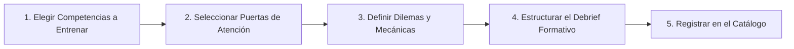

# GUÍA HUMANA DEL CEREBRO: DIGITAL SELF & ATTENTION DOORS
## Wiki de Navegación, Uso Comercial y Creación de Productos Formativos

> **Versión:** 1.0.0 — GUÍA PARA EL EQUIPO  
> **Fecha:** Septiembre 2026  
> **Audiencia:** Facilitadores, Equipo Comercial, Diseñadores Instruccionales, Desarrolladores y Socios Estratégicos.  
> **Propósito:** Explicar en lenguaje claro qué es el Cerebro V3, cómo está organizado, cómo consultarlo sin perderse y cómo utilizarlo para las dos metas inmediatas: **cerrar ventas con clientes B2B** y **diseñar la nueva oferta de productos formativos**.

---

## 🧭 1. ¿QUÉ ES ESTE "CEREBRO" Y POR QUÉ EXISTE?

Tras el éxito del primer webinar, el proyecto pasó de ser una idea exploratoria a un **producto de mercado**. 

Hasta ahora, parte del conocimiento estaba en la cabeza de los fundadores, parte en conversaciones de chat con ChatGPT, y parte atrapado en el código de programación. Eso impedía que el equipo pudiera vender con respaldo inmediato o crear nuevos talleres sin tener que reinventar la rueda cada vez.

El **Cerebro V3** (ubicado en la carpeta `/v3/brain/` del repositorio de GitHub) es la **única fuente de verdad oficial** del proyecto. 

### Los 3 Principios que Debes Conocer:
1. **Todo está en archivos de texto Markdown (`.md`):** No dependemos de Notion, ni de bases de datos cerradas. Se abre en cualquier editor de texto o directamente en la web de GitHub.
2. **El "Canon" vs. Borradores:** En este cerebro llamamos **Canon** a lo que el equipo ha validado formalmente como oficial (definiciones, reglas de juego, posturas éticas). Nada se inventa sobre la marcha.
3. **El Código NO es la Documentación:** Si quieres saber cómo funciona el juego FARO, qué significa un caso o cómo se calcula el puntaje, no tienes que leer JavaScript. Está escrito en español claro y estructurado en documentos de diseño de juego (GDD).

---

## 🏛️ 2. MAPA DE NAVEGACIÓN: LAS 8 CAPAS DEL CEREBRO

El cerebro está organizado como un edificio de 8 pisos lógicos. Cada piso tiene un letrero (`README.md`) en la entrada que te explica qué hay allí:

```text
/v3/brain/
├── 00_meta_and_governance/       --> LAS REGLAS DEL JUEGO Y DECISIONES (ADRs)
├── 01_research_and_lenses/       --> LA CIENCIA: Papers, Biblioteca y Lentes Teóricas
├── 02_framework_canon/           --> EL CORAZÓN DEL FRAMEWORK: Tesis, Digital Self y 9 Puertas
├── 03_methodology_and_learning/  --> LA PEDAGOGÍA: Cómo enseñamos, competencias y facilitación
├── 04_product_system/            --> LOS MOTORES: El juego FARO V3+, mecánicas y prompts
├── 05_products_catalog/          --> LOS PRODUCTOS EMPAQUETADOS: Webinar V1, Talleres, etc.
├── 06_evidence_and_validation/   --> LA EVIDENCIA: Resultados del webinar e hipótesis
├── 07_commercial_and_gotomarket/ --> LAS VENTAS: Argumentarios B2B, dolores de CISOs y precios
└── 99_archive_and_history/       --> EL BAÚL HISTÓRICO: Charlas fundacionales y borradores viejos
```

### ¿Qué encuentras exactamente en cada capa?

| Capa | Nombre | Para qué te sirve a ti |
| :--- | :--- | :--- |
| **00** | **Gobernanza y Decisiones** | Para saber **por qué** decidimos algo. Aquí está el `GLOSARIO_CANONICO.md` (términos oficiales y palabras prohibidas) y el `decision_log/` (los ADRs que explican, por ejemplo, por qué el Caso 3 nunca revela si el mensaje era falso). |
| **01** | **Investigación y Biblioteca** | Para respaldar una afirmación ante un cliente exigente. Contiene 5 fichas de papers clave (DBIR de Verizon, Kahneman, Rogers, etc.), la matriz de *Claims* científicos y las 7 *Lentes Teóricas* de la psicología y la IA. |
| **02** | **Canon del Framework** | **Nuestra Propiedad Intelectual.** Aquí están las definiciones de *Huella Digital*, *Digital Self*, el protocolo *P.A.R.A.* y las **fichas individuales de las 9 Puertas de Atención** (Identidad, Curiosidad, Responsabilidad, Justicia, Coherencia, Pertenencia, Protección, Pérdida, Rutina). |
| **03** | **Metodología y Aprendizaje** | El manual del facilitador. Explica por qué usamos simulaciones vivenciales en lugar de diapositivas aburridas, las 14 competencias que desarrollamos y la diferencia vital entre *Formación* (capacitar a la persona) e *Intervención* (cambiar las interfaces y políticas de la empresa). |
| **04** | **Sistema de Producto** | La especificación humana del juego **FARO V3+**. Describe los 4 casos del simulador, el HUD de pantallas, los prompts de la IA aliada y la matriz de puntuación D/N (Debía / No debía actuar). |
| **05** | **Catálogo de Productos** | Las fichas de lo que vendemos como experiencia terminada. Hoy contiene el `Webinar V1` y el espacio para los nuevos talleres de 2h y 4h. |
| **06** | **Evidencia y Validación** | Lo que aprendimos del primer webinar: métricas de engagement, interés de compra y lecciones cualitativas, separando honestamente lo que ya sabemos de lo que aún está en estudio. |
| **07** | **Comercial y Go-To-Market** | **El maletín de ventas B2B.** Posicionamiento contra el awareness tradicional, propuestas de valor para CISOs y CHROs, guión de reuniones comerciales y el archivo `evidence_for_sales.md`. |
| **99** | **Archivo Histórico** | Copias de seguridad de las conversaciones originales y notas previas. Está resguardado para no contaminar el día a día. |

---

## 💼 3. CÓMO USAR EL CEREBRO PARA EL TRABAJO COMERCIAL (VENTAS B2B)

El objetivo comercial inmediato es tener reuniones con **CISOs (Seguridad de la Información)**, **CHROs (Recursos Humanos / Talento)** y **Comités de Riesgo**.

### Tu Ruta Rápida de Preparación para una Reunión:
1. **Entender el Problema del Cliente (El dolor):**
   * Lee [`07_commercial_and_gotomarket/problem_space.md`](file:///d:/DCP/Proposito/LearnTheWorld/DigitalSelf_AttentionDoors/v3/brain/07_commercial_and_gotomarket/problem_space.md). Te da las palabras exactas para explicar por qué las campañas tradicionales de phishing ("mandar correos trampa y castigar al que cae") ya no funcionan frente a la IA generativa.
2. **Preparar el Argumentario según quién te escuche:**
   * Abre [`07_commercial_and_gotomarket/value_proposition.md`](file:///d:/DCP/Proposito/LearnTheWorld/DigitalSelf_AttentionDoors/v3/brain/07_commercial_and_gotomarket/value_proposition.md) y [`audiences_and_buyers.md`](file:///d:/DCP/Proposito/LearnTheWorld/DigitalSelf_AttentionDoors/v3/brain/07_commercial_and_gotomarket/audiences_and_buyers.md). 
   * Al CISO le hablas de *calibración de juicio, reducción de impulsividad y tiempo de reacción*.
   * Al de RRHH le hablas de *desarrollo de competencias, cero culpabilización y cultura de seguridad psicológica*.
3. **Utilizar solo Cifras y Datos Autorizados (Cero Alucinaciones de Venta):**
   * Abre [`07_commercial_and_gotomarket/evidence_for_sales.md`](file:///d:/DCP/Proposito/LearnTheWorld/DigitalSelf_AttentionDoors/v3/brain/07_commercial_and_gotomarket/evidence_for_sales.md). 
   * Contiene las estadísticas formales (ej. cifras del DBIR de Verizon sobre explotación de vulnerabilidades y phishing móvil). 
   * **Atención:** Cada dato tiene una sección *"Do not say"*; léela para no prometer cosas que la ciencia o el juego aún no respaldan (ej. nunca prometer "reducción del 100% de ataques").
4. **Estructurar la Reunión de Presentación:**
   * Sigue el guión paso a paso de [`07_commercial_and_gotomarket/sales_deck_script.md`](file:///d:/DCP/Proposito/LearnTheWorld/DigitalSelf_AttentionDoors/v3/brain/07_commercial_and_gotomarket/sales_deck_script.md).

---

## 🛠️ 4. CÓMO USAR EL CEREBRO PARA CONSTRUIR NUEVOS PRODUCTOS FORMATIVOS

El cliente corporativo querrá más que un webinar de 90 minutos: querrá talleres para ejecutivos, programas para áreas críticas (financiera, compras), juegos de mesa o simulaciones continuas.

### La Regla de Oro de Creación:
> **No inventes un nuevo framework para cada producto.** Todos los productos son "ventanas" o "ejercicios" que consumen el mismo ADN del cerebro.

### Paso a Paso para Diseñar una Nueva Oferta:



1. **Paso 1: Seleccionar qué competencias vas a desarrollar:**
   * Consulta [`03_methodology_and_learning/competencies_inventory.md`](file:///d:/DCP/Proposito/LearnTheWorld/DigitalSelf_AttentionDoors/v3/brain/03_methodology_and_learning/competencies_inventory.md). Elige 2 o 3 competencias para un taller corto (ej. *Reconocimiento de saliencia interna* y *Verificación por canales independientes*).
2. **Paso 2: Elegir qué Puertas de Atención se activarán:**
   * Abre [`02_framework_canon/attention_doors/`](file:///d:/DCP/Proposito/LearnTheWorld/DigitalSelf_AttentionDoors/v3/brain/02_framework_canon/attention_doors). Si el taller es para el área Financiera, consulta las fichas de `03_responsibility.md`, `07_protection.md` y `08_loss.md`. Esas fichas ya traen ejemplos legítimos y ejemplos de ingeniería social listos para convertir en casos.
3. **Paso 3: Diseñar los Casos con la Lógica de FARO:**
   * Mira cómo están redactados los casos del juego en [`04_product_system/reusable_components/games/faro_v3plus/cases/`](file:///d:/DCP/Proposito/LearnTheWorld/DigitalSelf_AttentionDoors/v3/brain/04_product_system/reusable_components/games/faro_v3plus/cases).
   * Todo buen caso tiene: un estímulo verosímil, una tensión emocional/puerta, un espacio de pausa (P.A.R.A.), y opciones donde la solución no es un simple "hacer clic / no hacer clic", sino elegir acciones reversibles de contención.
4. **Paso 4: El Debrief (Donde ocurre el aprendizaje):**
   * Consulta [`03_methodology_and_learning/learning_philosophy.md`](file:///d:/DCP/Proposito/LearnTheWorld/DigitalSelf_AttentionDoors/v3/brain/03_methodology_and_learning/learning_philosophy.md) y [`safe_deception_protocol.md`](file:///d:/DCP/Proposito/LearnTheWorld/DigitalSelf_AttentionDoors/v3/brain/03_methodology_and_learning/safe_deception_protocol.md).
   * La simulación solo sirve para generar sorpresa controlada; el aprendizaje real se fija en la conversación reflexiva posterior guiada por el facilitador.
5. **Paso 5: Registrar la ficha técnica del nuevo producto:**
   * Crea una nueva carpeta en [`05_products_catalog/`](file:///d:/DCP/Proposito/LearnTheWorld/DigitalSelf_AttentionDoors/v3/brain/05_products_catalog/) (ej. `workshops/workshop_inmersion_4h/PRODUCT_SPEC.md`). Declara qué componentes y puertas utiliza.

---

## 🚫 5. LO QUE NUNCA DEBEMOS DECIR (PALABRAS PROHIBIDAS)

Para mantener la seriedad ética y comercial, el cerebro tiene una **lista negra de términos**. Cualquier material, diapositiva o propuesta comercial debe evitar estas palabras:

1. ❌ **"El humano es el eslabón más débil"**  
   👉 *Decir:* "El humano es un agente de juicio y adaptación fundamental en el sistema sociotécnico".
2. ❌ **"Las puertas de atención son vulnerabilidades humanas"**  
   👉 *Decir:* "Son vías funcionales de prioridad atencional y saliencia cognitiva".
3. ❌ **"Te diagnosticamos tu puerta" / "Tu puerta psicológica es X"**  
   👉 *Decir:* "Observamos qué puerta se activó en este escenario simulado específico".
4. ❌ **"El juego FARO es tu enemigo / villano"**  
   👉 *Decir:* "FARO es un sistema autónomo que actúa bajo sus directrices programadas; el objetivo es ejercer gobierno y agencia sobre él".
5. ❌ **"Garantizamos 0 incidentes tras el taller"**  
   👉 *Decir:* "Desarrollamos capacidad deliberativa, metacognición y criterio frente a la influencia digital".

---

## 🔍 6. DÓNDE ESTÁN LOS ARCHIVOS DEL PROYECTO HOY

Si abres el repositorio en Visual Studio Code o en GitHub, esta es la estructura que verás:

* **[`/v3/brain/`](file:///d:/DCP/Proposito/LearnTheWorld/DigitalSelf_AttentionDoors/v3/brain)**: El Cerebro de Conocimiento que acabamos de describir.
* **[`/v3/app/`](file:///d:/DCP/Proposito/LearnTheWorld/DigitalSelf_AttentionDoors/v3/app)**: El código limpio del juego interactivo en producción.
* **[`/v3/research_library/`](file:///d:/DCP/Proposito/LearnTheWorld/DigitalSelf_AttentionDoors/v3/research_library)**: La biblioteca física de PDFs y papers científicos.
* **[`/v3/scripts/`](file:///d:/DCP/Proposito/LearnTheWorld/DigitalSelf_AttentionDoors/v3/scripts)**: Las herramientas que auditan y compilan el cerebro automáticamente.
* **[`/v2/`](file:///d:/DCP/Proposito/LearnTheWorld/DigitalSelf_AttentionDoors/v2)**: El código de respaldo que corrió en el webinar.

Cualquier persona del equipo puede entrar a `/v3/brain/INDEX.md` y, desde allí, navegar a cualquier rincón del conocimiento del proyecto con enlaces directos y explicaciones en español claro.
