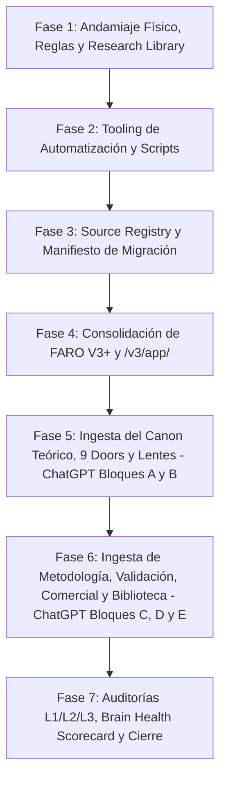

# PLAN DE IMPLEMENTACIÓN MAESTRO: CEREBRO DIGITAL SELF & ATTENTION DOORS (V1.2)
## Arquitectura Definitiva Integrada con el Scientific Library System

> **Versión:** 1.2 — PLAN MAESTRO COMPLETO Y BLINDADO  
> **Fecha:** 2026-09-03  
> **Estado:** Listo para Aprobación y Ejecución  
> **Alcance:** Implementación de la Arquitectura de 8 Capas Canónicas, el Sistema de Biblioteca Científica con Agente Bibliotecario, el Tooling de Auditoría Anti-Alucinación, y el Catálogo Completo de Prompts (Bloques A, B, C, D y E) para ChatGPT.

---

## 1. PRINCIPIOS NO NEGOCIABLES Y BLINDAJE OPERATIVO

1. **Un Solo Cerebro Activo (`/v3/brain/`):**
   * Todo el conocimiento estructurado vive en archivos Markdown (`.md`) dentro de `/v3/brain/`.
   * El código de producción activo reside en `/v3/app/`.
2. **Separación Física de Almacenamiento (Biblioteca Científica):**
   * Los PDFs, EPUBs y documentos completos originales se almacenan en **/v3/research_library/** fuera del cerebro de conocimiento.
   * El cerebro solo almacena las **Source Notes estructuradas (`SRC-XXXX.md`)** en `01_research_and_lenses/sources/`. Ningún agente carga archivos binarios pesados en su ventana de contexto cotidiano.
3. **Doble Eje de Clasificación:**
   * **Gobernanza:** `canonical | working | review | deprecated | archived`
   * **Estatus Epistemológico:** `established | supported | provisional | speculative | mixed | not_applicable`
   * *Regla de Oro:* `status: canonical` significa verdad oficial del equipo; **no** equivale automáticamente a verdad científica demostrada.
4. **La Especificación (GDD) es la Fuente de Verdad:**
   * `game_design_doc.md` manda sobre `game.js`. Divergencias detectadas por auditoría bidireccional bloquean CI y requieren decisión humana (ADR o corrección de código).
5. **Firewall del Archivo Histórico:**
   * Las conversaciones fundacionales y documentos maestros previos se preservan en Git dentro de `/v3/brain/99_archive_and_history/raw_sources/` con `status: archived`. Reglas de agente prohíben su ingesta automática en tareas cotidianas de diseño o venta.

---

## 2. ARQUITECTURA DE DIRECTORIOS COMPLETA

```text
DigitalSelf_AttentionDoors/
│
├── v3/                                         <-- ENTORNO CANÓNICO INTEGRADO
│   │
│   ├── brain/                                  <-- CEREBRO DE CONOCIMIENTO (SOLO TEXTO Y METADATOS)
│   │   ├── INDEX.md                            # MOC Maestro: Grafo de navegación general
│   │   ├── GLOSARIO_CANONICO.md                # Términos oficiales vigentes y terminología prohibida
│   │   ├── ESTADO_DEL_PROYECTO.md              # Versiones activas, productos y roadmap vivo
│   │   │
│   │   ├── 00_meta_and_governance/             # GOBERNANZA, ÉTICA Y ADRs
│   │   │   ├── README.md                       # MOC de Gobernanza
│   │   │   ├── canon_governance.md             # Ciclo de vida: Canonical, Working, Deprecated
│   │   │   ├── epistemic_status_standard.md    # Definición de los 6 niveles epistemológicos
│   │   │   ├── ontology_and_types.md           # Tipos de objeto válidos en el sistema
│   │   │   ├── terminology_rules.md            # Blacklist y reglas de nombrado
│   │   │   ├── ethical_guardrails.md           # Límites éticos: no humillar, safe deception, privacidad
│   │   │   ├── agent_operating_rules.md        # Reglas obligatorias para Antigravity y ChatGPT
│   │   │   ├── source_registry.yaml            # Registro central de todas las fuentes crudas
│   │   │   ├── migration_manifest.yaml         # Tracking granular de migración de insumos
│   │   │   ├── changelog.md                    # Registro formal de cambios de versiones
│   │   │   ├── decision_log/                   # Architectural Decision Records (ADRs)
│   │   │   │   ├── DEC-001_factor_humano_agencia.md
│   │   │   │   ├── DEC-002_nueve_attention_doors.md
│   │   │   │   ├── DEC-003_exclusion_jerarquia_validacion.md
│   │   │   │   ├── DEC-005_transicion_mira_a_faro.md
│   │   │   │   ├── DEC-006_caso_3_sin_ground_truth.md
│   │   │   │   ├── DEC-008_scoring_dinamico_DN.md
│   │   │   │   ├── DEC-010_caso_4_autenticidad_no_obvia.md
│   │   │   │   └── DEC-011_ia_espejo_sparring_asistente.md
│   │   │   ├── audit_rules/                    # Reglas de auditoría declarativas
│   │   │   └── audit_reports/                  # Reportes de Brain Health generados
│   │   │
│   │   ├── 01_research_and_lenses/             # INVESTIGACIÓN EXTERNA Y BIBLIOTECA CIENTÍFICA
│   │   │   ├── README.md                       # MOC de Investigación
│   │   │   ├── BIBLIOGRAPHY_MASTER.md          # [VISTA GENERADA] Índice maestro de fuentes
│   │   │   ├── RESEARCH_TAXONOMY.md            # Taxonomía gobernada de etiquetas temáticas
│   │   │   ├── librarian/                      # Protocolos operativos del Agente Bibliotecario
│   │   │   │   ├── LIBRARIAN_PROTOCOL.md       # Ciclo de vida: Receive -> Dedupe -> Read -> Note -> Route
│   │   │   │   ├── READING_TEMPLATE.md         # Plantilla estricta de lectura profunda
│   │   │   │   ├── INTAKE_RULES.md             # Criterios de admisión y licenciamiento
│   │   │   │   └── RESEARCH_GAPS.md            # Catálogo de vacíos empíricos identificados
│   │   │   ├── sources/                        # Source Notes individuales (SRC-XXXX.md)
│   │   │   ├── claims/                         # Matrices de Claims por dominio temático
│   │   │   │   ├── claims_human_factor.md
│   │   │   │   ├── claims_genai_social_engineering.md
│   │   │   │   ├── claims_attention_decision.md
│   │   │   │   ├── claims_training_learning.md
│   │   │   │   ├── claims_games_gamification.md
│   │   │   │   └── claims_human_ai.md
│   │   │   ├── syntheses/                      # Síntesis multi-fuente por tema
│   │   │   ├── theoretical_lenses/             # Las 9 lentes teóricas prestadas de la academia
│   │   │   │   ├── signal_detection_theory.md
│   │   │   │   ├── protection_motivation_theory.md
│   │   │   │   ├── tra_tpb_behavioral_intent.md
│   │   │   │   ├── cognitive_entrenchment_offloading.md
│   │   │   │   ├── judge_advisor_advice_taking.md
│   │   │   │   ├── trust_in_automation_reliance.md
│   │   │   │   └── self_determination_autonomy.md
│   │   │   └── industry_reports/               # Reportes técnicos (DBIR, Gartner, etc.)
│   │   │
│   │   ├── 02_framework_canon/                 # EL CANON TEÓRICO PROPIO (PROPIEDAD INTELECTUAL)
│   │   │   ├── README.md                       # MOC del Framework Canónico
│   │   │   ├── thesis.md                       # La tesis de agencia y nuevo perímetro humano
│   │   │   ├── sociotechnical_system.md        # El modelo de sistema sociotécnico
│   │   │   ├── human_agency.md                 # Definición canónica de agencia humana
│   │   │   ├── digital_footprint.md            # Huella digital (evidencia disponible)
│   │   │   ├── digital_self.md                 # Digital Self (representación funcional construida)
│   │   │   ├── attention_doors_model.md        # Modelo de Puertas como prioridades funcionales
│   │   │   ├── attention_doors/                # Fichas Vivas de las 9 Puertas Oficiales
│   │   │   │   ├── README.md
│   │   │   │   ├── 01_identity.md
│   │   │   │   ├── 02_curiosity.md
│   │   │   │   ├── 03_responsibility.md
│   │   │   │   ├── 04_justice.md
│   │   │   │   ├── 05_coherence.md
│   │   │   │   ├── 06_belonging.md
│   │   │   │   ├── 07_protection.md
│   │   │   │   ├── 08_loss.md
│   │   │   │   ├── 09_convenience_routine.md
│   │   │   │   └── relationships_and_overlaps.md
│   │   │   ├── decision_process.md             # Los 6 momentos y 3 macro-categorías funcionales
│   │   │   ├── internal_story.md               # Historia interna como producto emergente
│   │   │   ├── metacognition.md                # Función de la metacognición en la pausa
│   │   │   ├── PARA.md                         # Pausar, Analizar, Revisar, Actuar
│   │   │   ├── AI_roles.md                     # Espejo, Sparring, Asistente de decisión segura
│   │   │   ├── framework_ethics.md             # Principios éticos propios del framework
│   │   │   └── epistemic_boundaries.md         # Límites de validez de lo que afirmamos
│   │   │
│   │   ├── 03_methodology_and_learning/        # PEDAGOGÍA, FORMACIÓN Y FACILITACIÓN
│   │   │   ├── README.md                       # MOC Metodológico
│   │   │   ├── learning_philosophy.md          # Aprendizaje vivencial, consecuencias visibles, debrief
│   │   │   ├── training_vs_intervention.md     # Desarrollar capacidad vs. modificar el entorno
│   │   │   ├── competencies_inventory.md       # Las 14 competencias clave de agencia y criterio
│   │   │   ├── deliberate_practice.md          # Práctica deliberada y repetición espaciada
│   │   │   ├── simulation_based_learning.md    # Principios de simulación segura
│   │   │   ├── progressive_difficulty.md       # Andamiaje de complejidad cognitiva
│   │   │   ├── feedback_principles.md          # Feedback dinámico formativo vs punitivo
│   │   │   ├── safe_deception_protocol.md      # Reglas éticas del engaño pedagógico controlado
│   │   │   ├── continuous_training.md          # Modelos de entrenamiento distribuido
│   │   │   ├── transfer.md                     # Estrategias de transferencia al puesto de trabajo
│   │   │   ├── facilitation_principles.md      # Guía maestra del orquestador de sesiones
│   │   │   └── measurement_principles.md       # Principios de telemetría y métricas
│   │   │
│   │   ├── 04_product_system/                  # ADN REUTILIZABLE Y COMPONENTES
│   │   │   ├── README.md                       # MOC de Sistema de Producto
│   │   │   ├── design_principles.md            # Principios de diseño de producto
│   │   │   ├── game_design_principles.md       # Diseño de dilemas interactivos de decisión
│   │   │   ├── narrative_principles.md         # Tensión sociotécnica, ambigüedad sin cinismo
│   │   │   ├── analytics_principles.md         # Qué observar: reactividad, impulso, pausa
│   │   │   ├── common_mechanics/               # Candados, temporizadores, pausas reflexivas
│   │   │   ├── prompt_library/                 # Prompts canónicos (Espejo, Sparring, Asistente)
│   │   │   └── reusable_components/            # Componentes de software y simulación
│   │   │       └── games/
│   │   │           └── faro_v3plus/            # Componente Canónico FARO V3+
│   │   │               ├── GAME_SPEC.md        # GDD: Reglas, flujo y HUD sin código
│   │   │               ├── scoring_matrix_dn.json # Tabla de puntuación D/N máquina-legible
│   │   │               └── cases/              # Especificación narrativa de los Casos 1 al 4
│   │   │
│   │   ├── 05_products_catalog/                # PRODUCTOS CONCRETOS (EMPAQUETAMIENTOS)
│   │   │   ├── README.md                       # MOC del Catálogo
│   │   │   ├── webinars/
│   │   │   │   └── webinar_v1/                 # Webinar FARO ejecutado
│   │   │   │       ├── PRODUCT_SPEC.md         # Ficha técnica: uses_components [GAME-FARO-V3PLUS]
│   │   │   │       ├── learning_journey.md     # Journey: Confiar -> Ser modelado -> Notar -> Decidir
│   │   │   │       └── results_and_lessons.md  # Evidencia y aprendizajes del webinar
│   │   │   ├── workshops/                      # Blueprints de talleres de 2h y 4h
│   │   │   ├── programs/                       # Programas continuos de formación
│   │   │   ├── diagnostics/                    # Evaluaciones de patrones decisionales
│   │   │   ├── analog_products/                # Juegos de mesa y dinámicas físicas
│   │   │   └── future_products/                # Roadmap de nuevos formatos
│   │   │
│   │   ├── 06_evidence_and_validation/         # EVIDENCIA PROPIA Y VALIDACIÓN DEL FRAMEWORK
│   │   │   ├── README.md                       # MOC de Validación
│   │   │   ├── framework_hypotheses.md         # Hipótesis propias en proceso de validación
│   │   │   ├── validation_roadmap.md           # Plan de validación empírica a mediano plazo
│   │   │   ├── attention_doors_validation.md   # Roadmap específico de validación de las Doors
│   │   │   ├── product_evaluation_framework.md # Marco de evaluación de impacto
│   │   │   ├── product_evidence/               # Evidencia empírica propia generada
│   │   │   │   └── webinar_v1_evidence.md      # Datos de experiencia, aprendizaje y mercado
│   │   │   └── open_questions.md               # Preguntas abiertas del proyecto
│   │   │
│   │   ├── 07_commercial_and_gotomarket/       # OFERTA B2B Y ESTRATEGIA COMERCIAL
│   │   │   ├── README.md                       # MOC Comercial
│   │   │   ├── positioning.md                  # Categoría: Behavioral Cybersecurity & Human-AI Training
│   │   │   ├── problem_space.md                # Por qué el awareness tradicional falló
│   │   │   ├── value_proposition.md            # Propuesta para CISO, CHRO y Gestión de Riesgo
│   │   │   ├── audiences_and_buyers.md         # Buyer personas y dolores críticos
│   │   │   ├── offer_architecture.md           # Tiers: Keynote, Workshop, Diagnóstico, Programa
│   │   │   ├── use_cases.md                    # Casos de uso típicos en empresas
│   │   │   ├── evidence_for_sales.md           # Claims comerciales autorizados con fuentes y fechas
│   │   │   ├── objections.md                   # Manejo de objeciones comerciales frecuentes
│   │   │   └── sales_assets/                   # Guiones comerciales y estructuras de presentación
│   │   │
│   │   └── 99_archive_and_history/             # MEMORIA HISTÓRICA AISLADA (FIREWALL)
│   │       ├── README.md                       # MOC de Archivo
│   │       ├── raw_sources/                    # Conversaciones fundacionales y docs maestros originales
│   │       ├── conversations/                  # Transcripciones y resúmenes de chats fuente
│   │       ├── evolutions/                     # De MIRA a FARO, evolución V1 -> V2 -> V3+
│   │       ├── discarded_concepts/             # Conceptos descartados y por qué no se usaron
│   │       └── legacy_snapshots/               # Copias de seguridad de versiones previas
│   │
│   ├── research_library/                       # ALMACÉN FÍSICO DE FULL TEXTS (PDFs / EPUBs)
│   │   ├── README.md                           # Instrucciones de almacenamiento de biblioteca
│   │   ├── inbox/                              # Entrada de nuevos papers para procesar
│   │   ├── academic_articles/                  # Artículos revisados por pares
│   │   ├── reviews_meta_analyses/              # Revisiones sistemáticas y metaanálisis
│   │   ├── books_chapters/                     # Libros y capítulos de referencia
│   │   ├── industry_reports/                   # Informes técnicos y reportes de mercado
│   │   └── standards_regulation/               # Normas, marcos de trabajo y regulaciones
│   │
│   ├── app/                                    # CÓDIGO DE PRODUCCIÓN ACTIVO (FARO V3+)
│   │   ├── index.html                          # Interfaz web del juego
│   │   ├── game.js                             # Motor JS sincronizado con Supabase
│   │   ├── styles.css                          # Estilos de producción
│   │   └── assets/                             # Imágenes y multimedia
│   │
│   ├── scripts/                                # HERRAMIENTAS DE AUTOMATIZACIÓN Y AUDITORÍA
│   │   ├── audit_brain.js                      # Linter determinístico de integridad (L1)
│   │   ├── build_registry.js                   # Generador del registro ID -> path
│   │   ├── build_mocs.js                       # Generador automático de inventarios en README.md
│   │   ├── build_bibliography.js               # Compilador de BIBLIOGRAPHY_MASTER.md
│   │   ├── librarian_intake.js                 # Ingesta y registro de nuevos papers
│   │   ├── librarian_dedupe.js                 # Deduplicación por DOI/Hash
│   │   ├── manifest_manager.js                 # Auditor de migración de insumos
│   │   └── audit_spec_code_sync.js             # Auditoría bidireccional Spec <-> game.js
│   │
│   └── tests/                                  # SUITES DE CONFORMIDAD Y REGRESIÓN
│       ├── brain_semantic_regression.yaml      # Preguntas trampa de regresión semántica (L3)
│       └── audit_game_spec_sync.test.js        # Test automatizado de sincronización
│
├── .gitignore                                  # Control estricto de Git
└── README.md                                   # Puerta de entrada del repositorio
```

---

## 3. FASES DE IMPLEMENTACIÓN MAESTRAS



### Fase 1: Andamiaje Físico, Reglas de Agente y Research Library
* **Acciones en el repositorio:**
  1. Crear la estructura completa de carpetas dentro de `/v3/brain/` (8 capas activas + archivo).
  2. Crear la estructura física externa `/v3/research_library/` (`inbox/`, `academic_articles/`, `industry_reports/`, etc.).
  3. Crear los archivos raíz del cerebro: `/v3/brain/INDEX.md`, `/v3/brain/GLOSARIO_CANONICO.md` y `/v3/brain/ESTADO_DEL_PROYECTO.md`.
  4. Crear `/v3/brain/00_meta_and_governance/agent_operating_rules.md` (Scope activo en `/v3/brain/`, regla INDEX First, firewall de archivos históricos y firewall de PDFs).
  5. Crear los protocolos del bibliotecario en `/v3/brain/01_research_and_lenses/librarian/` (`LIBRARIAN_PROTOCOL.md`, `INTAKE_RULES.md`, `READING_TEMPLATE.md`, `RESEARCH_TAXONOMY.md`).
  6. Crear todos los `README.md` (MOCs base) en cada directorio.

### Fase 2: Tooling de Automatización, Scripts y Bibliotecario
* **Construcción de scripts en `/v3/scripts/`:**
  1. `build_registry.js`: Escanea el frontmatter de todos los `.md`, detecta IDs duplicados (`D001`) y genera `/v3/brain/00_meta_and_governance/registry.json`.
  2. `audit_brain.js`: Linter determinístico que valida schemas por `type` (`D010`), enlaces rotos (`D002`, `D003`), campos en `canonical` (`D011`), enums (`D012`), claims con fuentes (`D020`, `D021`), claims comerciales autorizados (`D023`), firewall de archivo (`D040`, `D041`) y lista negra de términos prohibidos (`D080`).
  3. `librarian_intake.js` y `librarian_dedupe.js`: Verificación de hashes SHA-256, deduplicación por DOI y creación de Source Notes.
  4. `build_bibliography.js`: Generación automática de `BIBLIOGRAPHY_MASTER.md`.
  5. `build_mocs.js`: Inyección automática de inventarios en los `README.md`.
  6. `audit_spec_code_sync.js`: Comparación bidireccional entre la especificación y `game.js` (`D070`).

### Fase 3: Registro de Fuentes Originales y Manifiesto de Migración
* **Acciones:**
  1. Generar `/v3/brain/00_meta_and_governance/source_registry.yaml` registrando los documentos maestros finales, conversaciones fundacionales y código previo con sus respectivos hashes.
  2. Generar `/v3/brain/00_meta_and_governance/migration_manifest.yaml` con tracking granular de extracción por categorías.
  3. Mover las fuentes crudas históricas a `/v3/brain/99_archive_and_history/raw_sources/`.

### Fase 4: Consolidación de FARO V3+ y Aplicación Activa (`/v3/app/`)
* **Acciones:**
  1. Trasladar el código de producción de `v2/` hacia `/v3/app/` (`index.html`, `game.js`, `styles.css`, `assets/`).
  2. Documentar en `/v3/brain/04_product_system/reusable_components/games/faro_v3plus/` la especificación canónica humana (`GAME_SPEC.md`), la matriz de scoring `scoring_matrix_dn.json` y la narrativa de los Casos 1 al 4.
  3. Documentar en `/v3/brain/05_products_catalog/webinars/webinar_v1/` el producto `PRODUCT_SPEC.md` declarando `uses_components: [GAME-FARO-SIMULATION-V3PLUS]`.
  4. Ejecutar `node v3/scripts/audit_spec_code_sync.js` para certificar 100% de conformidad inicial.

### Fase 5: Ingesta del Canon Teórico, 9 Doors y Lentes (ChatGPT - Bloques A y B)
* El usuario suministra los **Bloques A y B** de prompts a ChatGPT para recibir los ADRs iniciales, los documentos centrales del framework y las 9 fichas vivas atómicas. Antigravity los recibe, valida e integra en el árbol.

### Fase 6: Ingesta de Metodología, Validación, Comercial y Biblioteca (ChatGPT - Bloques C, D y E)
* El usuario suministra los **Bloques C, D y E** de prompts a ChatGPT para recibir las lentes teóricas, las matrices de claims por dominio, la metodología formativa, la evidencia del webinar, el kit comercial B2B y las primeras Source Notes de la biblioteca científica.

### Fase 7: Auditorías Integrales L1/L2/L3 y Emisión de Reporte Final
* **Acciones de cierre:**
  1. Configurar la suite de regresión semántica `/v3/tests/brain_semantic_regression.yaml` con las preguntas de calibración `KR-001` a `KR-010` y `KR-LIB-001` a `KR-LIB-003`.
  2. Ejecutar `npm run audit:brain` hasta alcanzar 100% PASS.
  3. Compilar `BIBLIOGRAPHY_MASTER.md` y actualizar MOCs.
  4. Generar el reporte oficial `/v3/brain/00_meta_and_governance/audit_reports/BRAIN_HEALTH_LATEST.md`.
  5. Emitir el reporte de resultado detallado para ChatGPT (Paso 8 y 9).

---

## 4. CATÁLOGO COMPLETO DE PROMPTS PARA CHATGPT (PASO 7)

*(Se presentan los textos completos y rigurosos listos para que el usuario los copie y entregue secuencialmente a ChatGPT).*

---

### 📦 BLOQUE A: Decision Log (ADRs) y Canon del Framework

```text
Estamos ejecutando el Paso 5/6 de la Arquitectura Definitiva del Cerebro Digital Self & Attention Doors en GitHub.
Necesito que generes el paquete canónico del Marco Teórico (Capa 02) y los Registros de Decisión (ADRs) iniciales, tomando como semilla principal el Documento Maestro final de Digital Self & Attention Doors y las decisiones de diseño acordadas.

Por favor genera los siguientes archivos en bloques Markdown completos e independientes, con su frontmatter YAML estricto:

1. ADRs en `00_meta_and_governance/decision_log/`:
   - `DEC-001_factor_humano_agencia.md`: Humano como agente, no eslabón más débil.
   - `DEC-002_nueve_attention_doors.md`: Catálogo oficial de nueve puertas y exclusión de jerarquía/validación.
   - `DEC-003_exclusion_jerarquia_validacion.md`: Razones explícitas de por qué no son puertas de atención.
   - `DEC-005_transicion_mira_a_faro.md`: Transición de MIRA a FARO como agente protector sociotécnico.
   - `DEC-006_caso_3_sin_ground_truth.md`: Por qué no se revela si el mensaje era legítimo.
   - `DEC-008_scoring_dinamico_DN.md`: Adopción de matriz Debía/No debía.
   - `DEC-010_caso_4_autenticidad_no_obvia.md`: Autenticidad no hace obvia la decisión; ampliación de repertorio.
   - `DEC-011_ia_espejo_sparring_asistente.md`: Los tres roles pedagógicos de la IA aliada.

2. Documentos Centrales en `02_framework_canon/`:
   - `thesis.md` (id: CON-THESIS): La tesis de agencia frente al avance de la IA.
   - `sociotechnical_system.md` (id: CON-SOCIOTECHNICAL): La interacción humano-organización-tecnología.
   - `human_agency.md` (id: CON-HUMAN-AGENCY): Definición canónica de agencia humana.
   - `digital_footprint.md` (id: CON-DIGITAL-FOOTPRINT): Definición de huella digital como evidencia disponible.
   - `digital_self.md` (id: CON-DIGITAL-SELF): Definición como representación funcional, qué es, qué NO es, allowed/forbidden synonyms.
   - `attention_doors_model.md` (id: CON-ATTENTION-DOORS): Definición como prioridades funcionales, qué son y qué NO son.
   - `decision_process.md` (id: CON-DECISION-PROCESS): Los momentos funcionales y las 3 macro-categorías (Entrada, Sentido, Salida).
   - `internal_story.md` (id: CON-INTERNAL-STORY): Por qué es un producto emergente y no un paso rígido.
   - `metacognition.md` (id: CON-METACOGNITION): Función de la metacognición en la pausa.
   - `PARA.md` (id: CON-PARA): Pausar, Analizar, Revisar, Actuar.
   - `AI_roles.md` (id: CON-AI-ROLES): Espejo, Sparring, Asistente de decisión segura.
   - `framework_ethics.md` (id: CON-FRAMEWORK-ETHICS): Principios éticos del framework (no culpar, no humillar).
   - `epistemic_boundaries.md` (id: CON-EPISTEMIC-BOUNDARIES): Separación estricta entre Canon e hipótesis en validación.

Asegura que cada archivo incluya en su frontmatter: `id`, `title`, `type`, `layer`, `status: canonical`, `epistemic_status`, `version: 1.0.0`, `author`, `summary`, `related` y `decisions`.
```

---

### 📦 BLOQUE B: Fichas Vivas de las 9 Attention Doors

```text
Continuando con la Capa 02 (`02_framework_canon/attention_doors/`), necesito la especificación atómica completa de las 9 Attention Doors oficiales más el archivo de relaciones y solapamientos.

Genera un archivo Markdown para cada una, siguiendo esta plantilla estricta:
Frontmatter YAML:
- `id`: DOOR-001 a DOOR-009
- `type: door`
- `layer: 02_framework_canon`
- `status: canonical`
- `epistemic_status: provisional` (recordar que la taxonomía integrada continúa en validación)
- `version: 1.0.0`
- `summary`: Resumen de 1 párrafo
- `related`: [IDs relacionados]

Estructura obligatoria de cada archivo:
1. Canonical Name & Definición canónica
2. Función adaptativa propuesta
3. Qué NO significa (límites conceptuales y errores frecuentes)
4. Sustratos teóricos y cognitivos relacionados
5. Contextos típicos donde adquiere prioridad
6. Señales internas observables (fisiológicas, emocionales o cognitivas)
7. Ejemplos de uso legítimo
8. Ejemplos de explotación en ingeniería social / IA
9. Aplicación en entrenamiento y formación
10. Límite ético (cómo evitar culpabilización o paranoia)

Archivos a generar:
- `01_identity.md` (DOOR-001)
- `02_curiosity.md` (DOOR-002)
- `03_responsibility.md` (DOOR-003)
- `04_justice.md` (DOOR-004)
- `05_coherence.md` (DOOR-005)
- `06_belonging.md` (DOOR-006)
- `07_protection.md` (DOOR-007)
- `08_loss.md` (DOOR-008)
- `09_convenience_routine.md` (DOOR-009)
- `relationships_and_overlaps.md` (DOOR-RELATIONS): Solapamientos, no asunción de independencia estadística, combinaciones frecuentes.
```

---

### 📦 BLOQUE C: Lentes Teóricas y Matrices de Claims

```text
Procedemos ahora con la Capa 01 (`01_research_and_lenses/`).
Necesitamos estructurar las lentes teóricas prestadas de la academia y las matrices de claims por dominio temático, distinguiendo cuidadosamente lo establecido de lo provisional.

Por favor genera:

1. Lentes Teóricas en `01_research_and_lenses/theoretical_lenses/` (Frontmatter: `type: theory_lens`, `status: canonical`, `epistemic_status: established`):
   Cada una respondiendo: qué explica, variables, relaciones, límites, conexión legítima con el framework y qué NO permite afirmar:
   - `signal_detection_theory.md` (THEORY-SDT)
   - `protection_motivation_theory.md` (THEORY-PMT)
   - `tra_tpb_behavioral_intent.md` (THEORY-TRA-TPB)
   - `cognitive_entrenchment_offloading.md` (THEORY-COG-OFFLOAD)
   - `judge_advisor_advice_taking.md` (THEORY-JUDGE-ADVISOR)
   - `trust_in_automation_reliance.md` (THEORY-TRUST-AUTO)
   - `self_determination_autonomy.md` (THEORY-SDT-AUTONOMY)

2. Matrices de Claims por Dominio en `01_research_and_lenses/claims/`:
   Archivos que agrupan de 5 a 10 claims individuales. Cada claim debe formularse en un bloque estructurado:
   - Claim ID (ej. CLAIM-HF-001)
   - Claim statement
   - Epistemic Status (established | supported | provisional | speculative | mixed)
   - Confidence (high | medium | low)
   - Scope
   - Supported by: [IDs de Sources]
   - Last verified
   - Allowed uses: [internal_research, training_content, commercial, external_publication]
   - Limitations & What it does not say

   Archivos a generar:
   - `claims_human_factor.md`
   - `claims_genai_social_engineering.md`
   - `claims_attention_decision.md`
   - `claims_training_learning.md`
   - `claims_games_gamification.md`
   - `claims_human_ai.md`
```

---

### 📦 BLOQUE D: Metodología, Validación Propia y Go-To-Market Comercial

```text
Completamos el cerebro con las Capas 03, 06 y 07 (`03_methodology_and_learning`, `06_evidence_and_validation`, `07_commercial_and_gotomarket`).

Por favor genera:

1. Metodología en `03_methodology_and_learning/`:
   - `learning_philosophy.md` (MET-PHILOSOPHY): Aprendizaje vivencial, consecuencias visibles, debrief.
   - `training_vs_intervention.md` (MET-TRAIN-VS-INTERV): Diferencia canónica entre desarrollar capacidad humana y modificar condiciones sociotécnicas.
   - `competencies_inventory.md` (MET-COMPETENCIES): Las 14 competencias de criterio y agencia.
   - `deliberate_practice.md` (MET-DELIBERATE-PRACTICE): Práctica situada y feedback formativo.
   - `safe_deception_protocol.md` (MET-SAFE-DECEPTION): Criterios de engaño pedagógico legítimo y ético.
   - `telemetry_and_analytics.md` (MET-TELEMETRY): Definición de calibración, reactividad e impulso, evitando diagnósticos psicométricos.
   - `facilitation_principles.md` (MET-FACILITATION): Guía maestra del facilitador / orquestador.

2. Evidencia y Validación en `06_evidence_and_validation/`:
   - `framework_hypotheses.md`: Hipótesis pedagógicas del framework actualmente en evaluación.
   - `validation_roadmap.md`: Hoja de ruta para la validación empírica.
   - `attention_doors_validation.md`: Estrategia de validación de la taxonomía de puertas.
   - `product_evidence/webinar_v1_evidence.md`: Auditoría de la evidencia del primer webinar separando estrictamente:
     * Experience evidence (engagement y satisfacción)
     * Learning evidence (uso de PARA y herramientas)
     * Market evidence (interés comercial y tracción B2B)
     * Effectiveness evidence (lo que aún NO está probado a largo plazo).

3. Estrategia Comercial en `07_commercial_and_gotomarket/`:
   - `positioning.md`: Categoría de mercado (Behavioral Cybersecurity & Human-AI Decision Training).
   - `problem_space.md`: Por qué falló el awareness tradicional y nuestra tesis.
   - `value_proposition.md`: Propuesta de valor para CISO, CHRO y Gestión de Riesgo.
   - `audiences_and_buyers.md`: Buyer personas y dolores corporativos.
   - `offer_architecture.md`: Tiers de producto (Keynote interactivo, Workshop de inmersión 2h/4h, Diagnóstico, Programa continuo).
   - `evidence_for_sales.md`: Banco de claims comerciales aprobados con fuentes, fechas de validez y prohibiciones explícitas de copywriting ("do not say").
   - `sales_deck_script.md`: Guión comercial estructurado para reuniones ejecutivas de ventas.
```

---

### 📦 BLOQUE E: Biblioteca Científica Inicial y Source Notes

```text
Estamos configurando el Scientific Library System dentro del Cerebro de Conocimiento en GitHub (`v3/brain/01_research_and_lenses/`).
Actuando bajo el protocolo del Agente Bibliotecario (`LIBRARIAN_PROTOCOL.md`), necesito que generes las Source Notes iniciales (`type: source`) para los artículos y documentos clave que respaldan nuestro framework.

Para cada fuente, genera un archivo Markdown atómico en `01_research_and_lenses/sources/SRC-XXXX.md` con su frontmatter YAML completo:
- `id`: SRC-XXXX
- `type: source`
- `status: canonical`
- `epistemic_status: not_applicable`
- `reading_status: complete`
- `reading_depth: full_text` (o abstract_only)
- `topics`: [tags de RESEARCH_TAXONOMY]
- `fulltext`: { availability, storage_type, location, sha256 }
- `summary`: Resumen de 1 párrafo

Y las secciones obligatorias:
1. Citation (APA)
2. Why this source matters
3. Study design / methodology
4. Main findings & quantitative results
5. Limitations stated by authors
6. What this source supports
7. What this source DOES NOT support (estricto: impedir sobreinterpretación)
8. Connections to Attention Doors / Theoretical Lenses
9. Candidate claims proposed

Fuentes iniciales prioritarias a generar:
- `SRC-VERIZON-DBIR-2026.md`: Verizon Data Breach Investigations Report (Factor humano, explotación de vulnerabilidades, phishing).
- `SRC-KAHNEMAN-2011.md`: Thinking, Fast and Slow (Sistema 1 / Sistema 2, heurísticas y sesgos en decisiones rápidas).
- `SRC-ROGERS-1975.md`: Protection Motivation Theory (Amenaza percibida, autoeficacia y conductas protectoras).
- `SRC-WOOD-NEAL-2007.md`: A new look at habits and the habit-goal interface (Hábitos, automaticidad y la Puerta de Conveniencia/Rutina).
- `SRC-VAFA-2026.md`: Context-aware spear phishing with LLMs (Personalización asistida por IA y nuevo riesgo).

Adicionalmente, genera el archivo inicial `01_research_and_lenses/librarian/RESEARCH_GAPS.md` listando los vacíos de investigación empírica identificados que requieren futuros estudios.
```

---

## 5. CRITERIOS DE ACEPTACIÓN Y CERTIFICACIÓN

1. **Integridad Determinística:** `npm run audit:brain` pasa al 100% sin IDs duplicados, enlaces rotos, schemas inválidos ni términos prohibidos (D001-D080 + D090-D096).
2. **Sincronización Spec-Code:** `node v3/scripts/audit_spec_code_sync.js` certifica que las reglas y matrices de `GAME-FARO-SIMULATION-V3PLUS` coinciden exactamente con `v3/app/game.js`.
3. **Suite de Regresión del Conocimiento:** `brain_semantic_regression.yaml` pasa las 13 pruebas de regresión (`KR-001` a `KR-010` y `KR-LIB-001` a `KR-LIB-003`).
4. **Compilación Bibliográfica:** `BIBLIOGRAPHY_MASTER.md` se compila sin errores a partir de las Source Notes.
5. **Scorecard Oficial:** Generación de `BRAIN_HEALTH_LATEST.md` con 100% de cobertura referencial antes del reporte final para ChatGPT.
