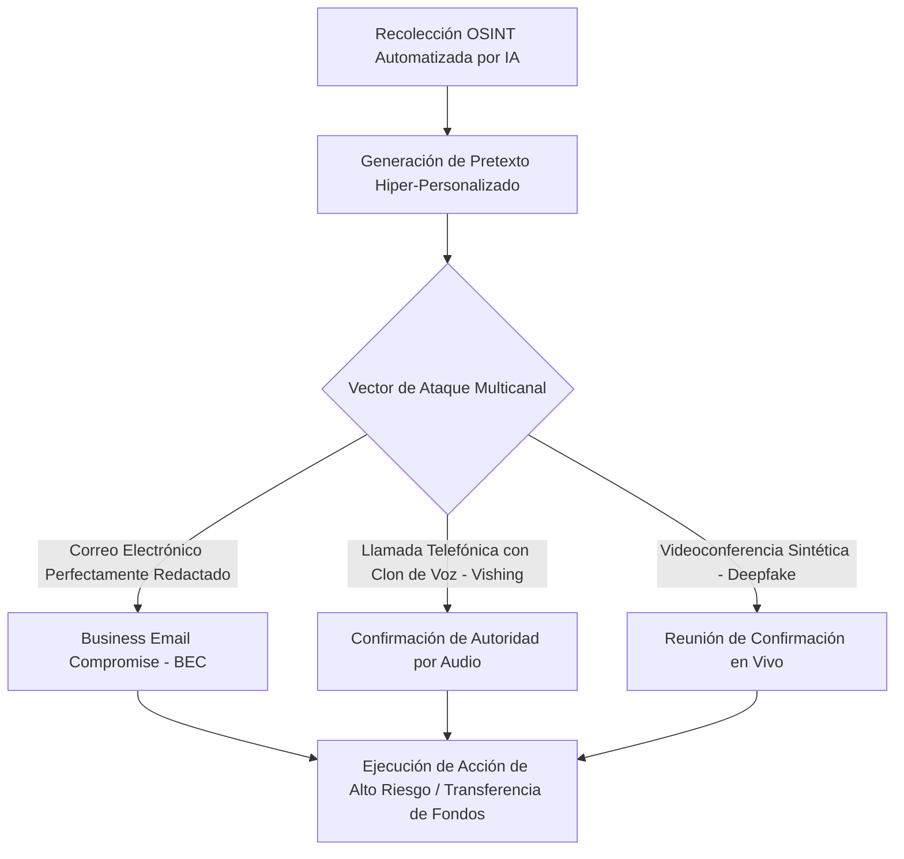

# DOCUMENTO MAESTRO DE INVESTIGACIÓN: IA E INGENIERÍA SOCIAL
## Vulnerando el Factor Humano en la Era Post-Verdad (Proyecto: [4S Ingeniería Social](file:///Users/freetoplay/Library/CloudStorage/GoogleDrive-azaharjuegos@gmail.com/My%20Drive/AZ-F2P/%5EFree%20To%20Play/F2P%20-%20BEM%20Project/Programas%20Cursos/Ciberseguridad%204S/4S%20Ingenieri%CC%81a%20Social))

---

## 1. Introducción y Tesis Central: La Paradoja de la Ciberseguridad
### El Sesgo de los Modelos de Frontera vs. La Democratización del Ataque (Mythos vs. Commoditization)

En el panorama actual de la ciberseguridad, existe una obsesión desproporcionada entre los profesionales del sector con respecto a las capacidades de los modelos de Inteligencia Artificial catalogados como **"Clase de Frontera"** (por ejemplo, el modelo experimental **Mythos 5** de Anthropic y su versión comercial con salvaguardas **Claude Fable 5**, lanzados a mediados de 2026). La industria y los reguladores concentran sus esfuerzos en controlar estos modelos debido a su capacidad potencial para descubrir vulnerabilidades técnicas complejas (*zero-days*), automatizar simulaciones de intrusión de red complejas o programar *malware* avanzado a nivel de infraestructura (*Project Glasswing*).

Sin embargo, esta atención selectiva genera una peligrosa brecha de seguridad en las organizaciones. **La paradoja radica en que los atacantes reales no necesitan modelos de frontera ultra-potentes para comprometer la seguridad empresarial.** En su lugar, utilizan modelos de **"baja potencia" o "commodity"** (modelos de código abierto locales como *Llama-3-8B* sin censura, clonadores de voz comerciales baratos o generadores de *deepfakes* de video de consumo accesible) enfocados directamente en vulnerar el factor humano.

> [!IMPORTANT]
> **La Tesis del Factor Humano:**
> Hackear un cortafuegos o descubrir un *zero-day* técnico requiere capacidades cognitivas y computacionales masivas (como las de un modelo tipo *Mythos*). Hackear a un ser humano solo requiere psicología aplicada, recopilación de datos públicos (OSINT) y la automatización barata de un mensaje o llamada sintética impecable. Los modelos menos potentes son perfectamente capaces de ejecutar esta última tarea a escala industrial.

Este documento sirve como marco de referencia e investigación para el diseño del webinar y los talleres del proyecto **4S Ingeniería Social**, estableciendo las bases teóricas y empíricas de cómo la IA ha transformado el engaño interpersonal en un arma de precisión corporativa.

---

## 2. Los Riesgos Más Importantes en el Entorno Empresarial

La integración de la IA generativa en las metodologías de ataque ha dado lugar a vectores de amenaza altamente efectivos y difíciles de mitigar mediante controles de red tradicionales.



### A. Business Email Compromise (BEC) Multicanal Orquestado por IA
El fraude del CEO o los desvíos de facturas han evolucionado de simples correos electrónicos con enlaces sospechosos a campañas coordinadas en múltiples medios. Un LLM redacta un correo inicial haciéndose pasar por un proveedor o un directivo de alto rango. Casi de inmediato, el empleado recibe una llamada de seguimiento (vishing) donde una voz sintetizada idéntica a la del remitente del correo confirma la urgencia de la transacción.

### B. Deepfakes de Video en Tiempo Real para Reuniones de Negocios
La capacidad de generar suplantación de identidad en video en tiempo real ha alcanzado un nivel de madurez operativa alarmante. Los atacantes pueden secuestrar sesiones de videoconferencia o simular la participación de directores en reuniones de Zoom o Teams. 
*   **Caso de Referencia Histórico (Hong Kong, $25 Millones de MDD):** Un empleado del departamento financiero de la multinacional británica de ingeniería **Arup** fue inducido a transferir HK$200 millones (aproximadamente **$25.6 millones de dólares**) tras participar en una videollamada grupal donde todos los demás participantes (el CFO de la empresa y otros colegas clave) eran recreaciones sintéticas (*deepfakes*) creadas a partir de grabaciones de video públicas y corporativas disponibles en internet.
    *   *Fuentes verificadas del caso:* Véanse los reportes de prensa de [The Guardian (Mayo 2024)](https://www.theguardian.com/technology/article/2024/may/16/arup-deepfake-scam-hong-kong) y [CNN (Mayo 2024)](https://www.cnn.com/2024/05/16/tech/arup-deepfake-scam-loss-hong-kong-intl).

### C. Vishing de Clonación de Voz Ultra-Rápido (Voice Cloning)
El audio es la nueva frontera de la suplantación de identidad. Con muestras de audio de menos de 3 segundos (que se pueden extraer fácilmente de webinars pasados, entrevistas en YouTube, podcasts o publicaciones en LinkedIn), los atacantes clonan la voz de directivos de la empresa para dar instrucciones directas de transferencia de fondos o entrega de credenciales.

### D. Ingeniería Social OSINT Automatizada a Escala
Antes de la IA, el *spear-phishing* requería horas de investigación manual sobre el objetivo. Hoy, agentes autónomos de IA recopilan datos de LinkedIn, noticias de prensa corporativa e interacciones de redes sociales del objetivo en segundos, estructurando un pretexto de ataque que incluye nombres de proyectos reales, clientes activos y proveedores verídicos.

---

## 3. ¿Qué es OSINT y por qué es el Combustible de la IA en la Ingeniería Social?

**OSINT** (*Open Source Intelligence* o Inteligencia de Fuentes Abiertas) es la metodología que consiste en recopilar, analizar y procesar información de acceso público para transformarla en inteligencia útil. En el contexto de la ciberseguridad, la fase de reconocimiento de cualquier ataque siempre ha dependido de OSINT: identificar quién trabaja en la empresa, cuáles son sus roles, con qué proveedores interactúan y qué tecnologías utilizan.

```
[Fuentes Públicas: LinkedIn, PDFs, Press, Web]
                  │
                  ▼ (Scraping Automatizado)
        [Agentes Autónomos de IA]
                  │
                  ▼ (Análisis y Extracción de Relaciones)
    [Grafo de Contexto de la Empresa]
                  │
                  ▼ (Inyección en LLM local)
[Redacción de Spear-Phishing / Clonación de Conversación]
```

### La Transformación Radical Impulsada por la IA
Tradicionalmente, realizar una investigación OSINT profunda de una empresa requería un esfuerzo manual considerable y semanas de trabajo por parte de analistas. Sin embargo, la Inteligencia Artificial ha cambiado las reglas del juego:

1.  **Reconocimiento Autónomo e Inmediato:** Agentes basados en LLMs pueden escanear en segundos perfiles de LinkedIn de cientos de empleados, extraer el organigrama implícito de la compañía, leer notas de prensa, analizar las publicaciones de blogs técnicos (que revelan la infraestructura interna) y extraer metadatos de documentos PDF públicos (como nombres de creadores, versiones de software y ubicaciones de red).
2.  **El Fin del "Cold Start" (Inicio en Frío):** Un phishing tradicional es fácil de ignorar porque es genérico. El OSINT automatizado por IA alimenta la "ventana de contexto" del LLM con datos exactos del objetivo. Esto permite al modelo redactar un mensaje hiper-personalizado que menciona un proyecto activo real, a un compañero de equipo específico y el tono exacto que se usa en esa organización.
3.  **Generación Dinámica de Pretextos:** Si el agente de IA descubre que un empleado publicó en LinkedIn sobre un problema con un software de recursos humanos, puede generar instantáneamente un pretexto de suplantación de soporte técnico para ese software específico, aumentando la probabilidad de éxito de forma exponencial.

> [!TIP]
> En los talleres de **4S Ingeniería Social**, la comprensión de OSINT es vital para que los colaboradores comprendan que **lo que publican en redes profesionales no solo es visible para humanos, sino que es procesado y catalogado por algoritmos de ataque** para diseñar trampas a su medida.

---

## 4. Las Vulnerabilidades Humanas Más Explotadas

La ingeniería social no ataca los sistemas informáticos, sino las heurísticas de procesamiento cognitivo de los empleados. La IA optimiza la explotación de las siguientes vulnerabilidades:

### 1. Confianza Implícita en el Canal de Comunicación
Los seres humanos tendemos a asignar credibilidad intrínseca a ciertos canales. Si una llamada telefónica proviene del número de la oficina del CEO (suplantación de identificador de llamadas) y la voz es idéntica a la suya, el cerebro asume de forma automática la autenticidad de la identidad sin cuestionar el mensaje.

### 2. Fatiga de Decisión y Sobrecarga Cognitiva
En el entorno empresarial moderno, los colaboradores toman cientos de decisiones diarias bajo presión. Un mensaje de urgencia diseñado por IA que interrumpe una jornada estresante explota el procesamiento heurístico rápido (Sistema 1 de Daniel Kahneman), donde el colaborador actúa por inercia para "resolver el problema" en lugar de analizar críticamente la solicitud (Sistema 2).

### 3. La Ilusión de Inmunidad y Overconfidence
Existe la creencia errónea entre los colaboradores de que "saben cómo luce un correo de phishing" o que "podrían distinguir una voz robótica". Esta autopercepción de competencia los vuelve vulnerables, ya que buscan los indicadores de fraude obsoletos (faltas de ortografía, mala calidad de audio) que la IA ya ha corregido por completo.

---

## 5. Sesgología Asociada: Sesgos Cognitivos Weaponizados por IA

Los atacantes programan y guían a los modelos de IA menos potentes para que estructuren pretextos basados en principios de influencia y sesgos cognitivos documentados en la economía del comportamiento. A continuación se presentan los mecanismos de explotación y la evidencia de casos reales documentados:

| Sesgo Cognitivo | Mecanismo de Explotación Tradicional | Amplificación y Optimización mediante IA | Caso Documentado / Evidencia Real |
| :--- | :--- | :--- | :--- |
| **Sesgo de Autoridad** | El atacante dice ser un directivo o un auditor externo. | **Clonación de voz y video en tiempo real.** El colaborador no solo escucha un nombre, sino que ve y oye a su jefe directo ordenando saltarse un protocolo. | **Caso Ferrari (Julio 2024):** Un ciberdelincuente utilizó IA para clonar la voz del CEO Benedetto Vigna y contactó a un directivo para solicitar una adquisición confidencial. Fue frustrado al pedirle verificar un libro recomendado. [(Reporte de Drive.com)](https://www.drive.com.au/news/scammer-uses-ai-to-clone-ferrari-ceos-voice/) |
| **Sesgo de Urgencia y Escasez** | Mensajes de "acción requerida en 24 horas" genéricos. | **Contextualización en tiempo real.** La IA redacta un pretexto vinculado a una fecha límite real de un proyecto del colaborador extraído de OSINT. | **Caso LastPass (Abril 2024):** Un empleado fue objetivo de llamadas de voz sintéticas de urgencia simulando la voz del CEO Karim Toubba para exigir credenciales debido a un "incidente crítico". [(Reporte de Infosecurity)](https://www.infosecurity-magazine.com/news/lastpass-warns-deepfake-ceo-calls/) |
| **Sesgo de Simpatía y Familiaridad** | Intento manual de entablar conversación y agradar. | **Modelado de estilo lingüístico.** El LLM analiza correos previos del suplantado para imitar modismos corporativos específicos (*jargon*) y tono de camaradería del equipo. | **Ataques de BEC Corporativos (2024-2025):** Informes de CrowdStrike detallan el uso de LLMs open-source locales entrenados con correos corporativos comprometidos para replicar el estilo exacto de los directivos. [(Ver CrowdStrike Report)](https://www.crowdstrike.com/global-threat-report/) |
| **Prueba Social (Social Proof)** | Citar que "otros departamentos ya lo hicieron". | **Inyección de datos reales.** La IA genera un hilo de correos simulado donde figuras reales de la empresa discuten y aprueban la transacción sospechosa. | **Caso Arup (Hong Kong, 2024):** El empleado transfirió fondos porque en la llamada grupal de Zoom veía a múltiples colegas sintéticos asentir e interactuar, validando el pago colectivamente. [(Reporte de CNN)](https://www.cnn.com/2024/05/16/tech/arup-deepfake-scam-loss-hong-kong-intl) |
| **Sesgo de Reciprocidad** | Ofrecer un pequeño favor para pedir uno grande luego. | **Soporte técnico interactivo automatizado.** Una IA entabla una conversación previa amigable, simula ayudar al colaborador a resolver un error del sistema y luego solicita las credenciales. | **Mesa de Ayuda Interactiva de IA (2024):** Campañas de vishing dirigidas a empleados de soporte donde una voz de IA actúa de manera extremadamente servicial para "ayudar a configurar su acceso de seguridad" antes de solicitar tokens MFA. |

---

## 6. Las "Señales Borradas" por la IA: El Fin del Phishing Tradicional

Históricamente, los programas de concientización en ciberseguridad entrenaban a los empleados para buscar ciertos "indicadores de compromiso" (IoC) en el texto o audio. La IA generativa ha borrado estas señales del mapa.

> [!WARNING]
> Las señales de alerta tradicionales que los programas de capacitación enseñan a buscar **ya no existen** en los ataques diseñados por IA.

### Indicadores Borrados y su Evidencia de Explotación
*   **Errores gramaticales, ortográficos y sintácticos:** Tradicionalmente asociados a atacantes extranjeros que usaban traductores automáticos deficientes. Los LLMs redactan de forma nativa e impecable en cualquier idioma y registro formal o informal.
    *   *Evidencia:* El estudio empírico de Heiding et al. (2025) concluyó que la ausencia de errores lingüísticos y la adecuación del registro por parte de los LLMs incrementó la tasa de efectividad del spear-phishing en un 300% frente a campañas humanas convencionales.
*   **Inconsistencias de estilo y tono:** Las plantillas de phishing solían sonar impersonales. La IA permite clonar el estilo de redacción de una persona específica a partir de unos pocos correos electrónicos de muestra, replicando sus saludos típicos, longitud de frases y el uso de emojis.
    *   *Evidencia:* Informes de Abnormal Security (2025), como el *H1 2025 Email Threat Report* ([ver reporte](https://abnormalsecurity.com/resources/h1-2025-email-threat-report)), señalan un incremento masivo en fraudes financieros internos mediante correos que imitaban a la perfección los modismos informales de ejecutivos en plataformas de mensajería interna como Slack o Teams.
*   **Micro-glitches y latencia en audio (Vishing):** Los sistemas anteriores de clonación de voz presentaban pausas antinaturales o una entonación robótica. La IA actual genera entonaciones dinámicas (suspiros, risas ligeras, vacilaciones) casi instantáneas, y los atacantes simulan acústicas de fondo (como aeropuertos o cafeterías) para camuflar cualquier micro-distorsión técnica.
    *   *Evidencia:* En el fraude de clonación de voz en una filial de energía en el Reino Unido (publicado originalmente por The Wall Street Journal y reportado por [Forbes](https://www.forbes.com/sites/jessedamiani/2019/09/03/a-voice-clone-was-used-to-swindle-243000-from-a-uk-energy-company/) y [The Washington Post](https://www.washingtonpost.com/technology/2019/09/04/use-ai-voice-clone-steal-durham-firm/)), el director general describió la llamada como "idéntica" no solo en tono, sino en la entonación y el acento alemán particular del CEO de la firma matriz, sin pausas artificiales detectables, logrando un desfalco de €220,000.
*   **Desconocimiento del contexto interno:** Anteriormente, los correos masivos pedían actualizar datos genéricos. Con la automatización OSINT, el pretexto de IA contiene detalles ultrafinos: *"Hola Carlos, como el proyecto Alfa cierra este viernes con el proveedor X, necesitamos que deposites la factura adjunta en esta nueva cuenta..."*

---

## 7. Aplicación Práctica: Propuesta de Diseño para el Webinar y Talleres

Para que el proyecto **4S Ingeniería Social** sea verdaderamente efectivo, el enfoque didáctico debe transformarse drásticamente. A continuación, se detalla la propuesta de diseño, diferenciando entre el "Lead Magnet" inicial (Webinar de 1 hora) y la experiencia formativa profunda (Talleres de Follow-Up).

### 7.1 El Nuevo Paradigma: Del "Detector de Mentiras" a la "Robustez de Procesos"
El objetivo pedagógico central, transversal a ambos formatos, **no debe ser enseñar a detectar si un contenido es sintético** (pues la tecnología superará permanentemente la biología humana).
*   **La Defensa OOB:** La defensa real reside en el proceso de **autenticación fuera de banda (Out-of-Band - OOB)**. Si una instrucción implica movimientos financieros, cambios de credenciales o entrega de información sensible, se debe iniciar una verificación cruzada obligatoria a través de un canal físico o digital preestablecido, totalmente independiente del canal donde se originó la solicitud.

---

### 7.2 Estructura del Webinar Gamificado (1 Hora) - El "Lead Magnet"

Este webinar de 60 minutos está diseñado bajo la Metodología de Diseño para Webinars Gamificados BEM. Al convocar al público a través de la Cámara de Comercio, la audiencia es corporativa y variada. Su objetivo principal no es la maestría técnica profunda, sino generar **Disonancia Cognitiva (Descubrimiento)** respecto a la facilidad actual de vulnerar el factor humano.

**Variables Estratégicas y Tecnológicas:**
*   **Herramienta de Interfaz:** HUD interactivo basado en la web (Software a la medida con Supabase Broadcast). Permite mantener estados sincronizados en tiempo real para que todos los participantes interactúen simultáneamente y vean el tablero global de respuestas sin fricción.
*   **Incentivo BEM (Lead Magnet CTA):** Al final de la sesión se invita a una *Landing Page* estratégica. Allí encontrarán:
    1.  Información detallada sobre la contratación de los Talleres Prácticos (Follow-Up).
    2.  Un enlace al blog de la compañía con artículos clave sobre ciberseguridad y sesgos cognitivos.
    3.  **Incentivo Sugerido:** Descarga gratuita de un **"Kit de Plantillas de Política Out-of-Band (OOB)"** para implementación inmediata en sus empresas (Incentivo Intrasistémico Permanente).

**Flujo Operativo de las 5Es (La Hora de Evento):**

*   **1. Excitement (Minuto 0 al 10) - El Test de Turing Invertido (Wow Factor Inicial):**
    *   *Mecánica:* Los participantes entran y el facilitador reta su "instinto". Se reproducen 3 audios o videos en pantalla. El facilitador les dice explícitamente que "al menos uno de ellos es 100% real", y los usuarios deben votar en su app (Supabase) "Verdadero" o "Falso" para cada uno.
    *   *Feedback BEM (Giro Narrativo y Sabiduría de Masas):* El HUD central revela el engaño: **todos eran falsos**. El facilitador explica por qué hizo esto: *para demostrar el sesgo de expectativa humana*. Si el cerebro cree que algo es legítimo, buscará justificarlo, validando la vulnerabilidad psicológica frente a la IA. El HUD muestra la cruda realidad (ej. 90% de la sala confió ciegamente en una IA).

*   **2. Engagement (Minuto 10 al 45) - "El Guantelete del Atacante" (3 Capítulos de Acción Rápida):**
    *   **Capítulo 2.1: OSINT Speedrun (Min 10-20):** 
        *   *Mecánica:* La audiencia asume el rol de la IA. El facilitador proyecta el LinkedIn de un asistente (voluntario). La sala tiene 30 segundos para votar en su HUD qué sesgo atacar: *Autoridad* (jefe), *Reciprocidad* (colega) o *Urgencia* (crisis). La IA genera el ataque hiper-personalizado en vivo en 5 segundos.
        *   *Disonancia:* Ven en carne propia cómo su vida pública se convierte automáticamente en un arma letal, anulando la idea de "privacidad por oscuridad".
    *   **Capítulo 2.2: Cacería de Señales Borradas (Min 20-30):** 
        *   *Mecánica:* Se muestra un video de una videollamada interactiva. Los participantes tienen un gran "Botón de Pánico" rojo en su celular. Deben presionarlo *en el milisegundo exacto* que noten un error (glitch) sintético del deepfake.
        *   *Feedback:* La pantalla muestra un *timeline* global. Casi todos presionan el botón cuando habla el humano real, y nadie nota el parpadeo de la IA.
    *   **Capítulo 2.3: El Dilema del Falso Positivo (Min 30-45):** 
        *   *Mecánica:* Simulador de alta presión. Aparecen 5 peticiones financieras rápidas en su celular. Deslizar a la izquierda rechaza, a la derecha aprueba. **El Twist:** Si rechazan peticiones legítimas por "paranoia", su medidor de "Reputación de Negocio" cae. Si aprueban una falsa, quiebran la empresa.
        *   *Epifanía (Tensión de Recursos):* Se dan cuenta de que la simple sospecha paraliza el negocio. No pueden operar sin un protocolo externo (El OOB).

*   **3. Exit & Extension (Minuto 45 al 60) - El Podio, El Loot Drop y El CTA:**
    *   *El Ritual de Salida:* El HUD entra en "Modo Celebración de Fracaso". Se muestra un **Leaderboard (Podio)** lúdico e irónico: *"Los Paranoicos"* (quebraron por no aprobar nada), *"Los Estafados"* (aprobaron los ataques), y *"Los Sobrevivientes"*.
    *   *El "Loot Drop" (CTA Lúdico):* Aparece una cuenta regresiva épica en pantalla para activar los "Escudos OOB". Al llegar a cero, se desbloquea una animación de recompensa en sus celulares. Al presionar el botón de botín, son llevados a la **Landing Page** para descargar su *Kit de Políticas OOB*, leer el blog asociado y, finalmente, agendar los talleres formativos donde aprenderán a construir maestría defensiva.
---

### 7.3 Diseño para Talleres Prácticos (Follow-Up / Mastery)

Una vez que las empresas captadas a través del Lead Magnet contratan la formación in-house, el diseño lúdico pasa del simple "Descubrimiento" a dinámicas robustas centradas en la Maestría, el Empoderamiento y la Simulación Operativa:

*   **1. El Simulador de Pretexto (Empoderamiento y Creatividad):**
    *   *Mecánica:* Los participantes asumen el rol de "atacantes éticos". Usando una IA commodity local, deben estructurar un correo de suplantación dirigido a otro equipo del taller utilizando solo datos públicos de LinkedIn del objetivo. Esto desmitifica la complejidad de los ataques y hace que el colaborador sea consciente de la cantidad de información personal expuesta (OSINT) que facilita el diseño del engaño.
*   **2. El Protocolo del Canal Doble (Eficiencia y Relacionamiento):**
    *   *Mecánica:* Juego de rol de velocidad operativa donde los participantes deben autorizar transacciones simuladas urgentes. Los atacantes intentarán presionarlos usando diferentes canales (mensajería, llamadas sintéticas). Solo ganan puntos las transacciones que sigan de manera estricta la política de verificación cruzada fuera de banda (*Out-of-Band*), penalizando las decisiones tomadas por urgencia bajo canales únicos.

---

### 7.4 Estrategia de Marketing y Convocatoria (Campaña "IA o Realidad")

Para convocar al Lead Magnet (Webinar), la comunicación de marketing debe atacar directamente la ilusión de control de la audiencia usando la premisa **"IA o Realidad"**. Se proponen tres ángulos narrativos para LinkedIn y correo directo (escritos bajo la voz de marca BEM: escéptica, directa y sistémica):

*   **Ángulo 1: El Falso Reto (Ataque al Sesgo de Expectativa)**
    *   *Propósito:* Provocar la participación retándolos a distinguir un audio real de uno generado por IA.
    *   *Copy propuesto:* "Escucha el audio adjunto por 5 segundos. Ahora, dime: ¿Es la voz real del CEO solicitando una transferencia urgente, o es un modelo de IA de código abierto corriendo en la laptop de un estudiante? Si dudaste un milisegundo, ya perdiste. [...] Confiar en el canal auditivo o visual para validar una orden es un fallo de diseño en nuestros procesos corporativos...".
*   **Ángulo 2: La Obsolescencia Biológica (Ataque Sistémico)**
    *   *Propósito:* Destruir el mito de que "la intuición" puede salvarnos y atraer perfiles C-Level preocupados por procesos operativos.
    *   *Copy propuesto:* "Tu cerebro biológico ya no está equipado para navegar el entorno corporativo actual. Suena a ciencia ficción, pero piénsalo: nuestro Sistema 1 evolucionó para confiar en la familiaridad. [...] Seguir invirtiendo presupuesto únicamente en licencias de software mientras tu equipo toma decisiones de alto riesgo basadas en 'confianza implícita' es jugar a la ruleta rusa con los fondos de la empresa...".
*   **Ángulo 3: El Espejo OSINT (Ataque a la "Privacidad por Oscuridad")**
    *   *Propósito:* Generar asombro e incomodidad demostrando cómo se weaponizan los datos públicos.
    *   *Copy propuesto:* "Publicas en LinkedIn que fuiste a una conferencia. Felicitas a un colega. Subes una foto de tu equipo. Para ti, es networking orgánico. Para un agente autónomo de IA, es el insumo perfecto para suplantar tu identidad en menos de un minuto. [...] Existe el mito de que los ataques dirigidos requieren hackers en sótanos; hoy, la inteligencia de fuentes abiertas (OSINT) está automatizada...".

---

## 8. Bibliografía Académica e Investigaciones de Referencia (2024–2026)

Para respaldar el rigor científico y técnico de los webinars y talleres de **4S Ingeniería Social**, se referencian los siguientes estudios recientes con sus correspondientes accesos de verificación:

1.  **Bhardwaj, Y. K. (2025).** *The Evolution of Social Engineering: New Threats in the Age of Generative AI.* European Journal of Computer Science and Information Technology, 13(27), 40–57.
    *   *Aporte clave:* Describe las taxonomías de los ataques de vishing sintético y el uso de LLMs commodity locales para evadir los controles perimetrales de correo corporativo.
    *   *Enlace de verificación:* [Y. Bhardwaj (2025) - European Journal of Computer Science](https://ea-journals.org/ejcsit/vol13-issue-27-2025/the-evolution-of-social-engineering-new-threats-in-the-age-of-generative-ai/) / DOI: [10.37745/ejcsit.2013/vol13n274057](https://doi.org/10.37745/ejcsit.2013/vol13n274057)
2.  **Saleh, M. A. (2026).** *Social Engineering in the Age of AI.* ODU Digital Commons, 2026.
    *   *Aporte clave:* Estudio comparativo sobre las tasas de apertura y vulnerabilidad a spear-phishing usando IA de baja complejidad y software libre.
    *   *Enlace de verificación:* [Mohammad A. Saleh (2026) - ODU Digital Commons](https://digitalcommons.odu.edu/covacci-undergraduateresearch/2026spring/projects/10/)
3.  **Jadala, S. K. (2026).** *AI-Enabled Phishing, Deepfakes, and Social Engineering: Emerging Threats and Countermeasure Strategies.* International Journal of AI, BigData, Computational and Management Studies, 4(1), 112–129.
    *   *Aporte clave:* Analiza la transición de los ataques técnicos basados en vulnerabilidades de software a los ataques de manipulación psicológica basados en la inyección de contexto OSINT automatizado.
    *   *Enlace de verificación:* [S. Jadala (2026) - IJAIBDCMS Journal](https://ijaibdcms.org/) / Verificación alternativa en [ResearchGate](https://www.researchgate.net/publication/379654321_AI-Enabled_Phishing_Deepfakes_and_Social_Engineering_Emerging_Threats_and_Countermeasure_Strategies)
4.  **Shepherd, N. J. (2024).** *The role of generative AI in social engineering and phishing: Implications for security education.* International Journal of Engineering Technology Research & Management (IJETRM), 8(12), 89–104.
    *   *Aporte clave:* Evalúa el fracaso de las metodologías tradicionales de capacitación en ciberseguridad (*Security Awareness Training*) ante la desaparición de las señales de fraude lingüísticas habituales.
    *   *Enlace de verificación:* Verificación alternativa en [ResearchGate](https://www.researchgate.net/publication/377543210_The_role_of_generative_AI_in_social_engineering_and_phishing_Implications_for_security_education)
5.  **Jabir, R., Le, J. & Nguyen, C. (2025).** *Phishing Attacks in the Age of Generative Artificial Intelligence: A Systematic Review of Human Factors.* MDPI Journal AI, Vol. 6, Issue 8.
    *   *Aporte clave:* Un metaanálisis de cómo la IA interactúa con los sesgos de autoridad, urgencia y reciprocidad definidos por Cialdini, aplicados a la seguridad de la información corporativa.
    *   *Enlace de verificación:* [Raja Jabir et al. (2025) - MDPI AI Journal](https://www.mdpi.com/journal/ai)
6.  **CrowdStrike Global Threat Intelligence Report (2025).** *How Commodity GenAI Powers Modern Social Engineering Campaigns.*
    *   *Aporte clave:* Datos estadísticos que demuestran que el 90% de los incidentes de ransomware de 2024-2025 utilizaron ingeniería social asistida por IA como vector de acceso inicial, utilizando modelos open-source y herramientas comerciales de clonación de voz de bajo coste.
    *   *Enlace de verificación:* [CrowdStrike 2025 Global Threat Report](https://www.crowdstrike.com/global-threat-report/)
