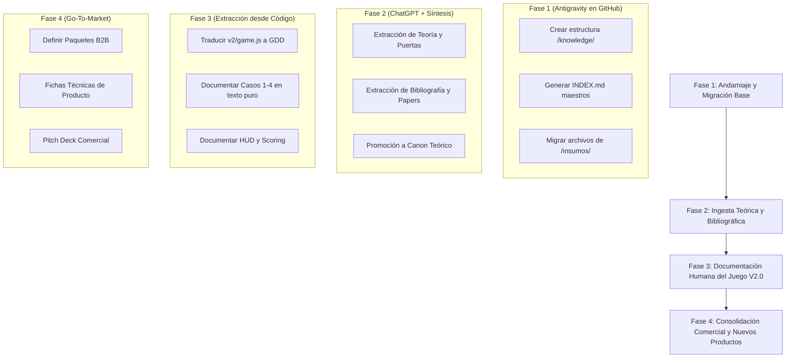

# ARQUITECTURA INTEGRAL DEL CEREBRO DE CONOCIMIENTO
## Framework: "Digital Self & Attention Doors"
### Basado en el Modelo Karpathy (LLM-Oriented Knowledge Base / Second Brain)

> **Documento de Diseño y Plan de Trabajo para Contraste y Evaluación**  
> **Versión:** 1.0-DRAFT  
> **Fecha:** Septiembre 2026  
> **Propósito:** Servir como base técnica, taxonómica y metodológica para ser contrastada con la propuesta de ChatGPT y definir el estándar definitivo del proyecto.

---

## 1. FUNDAMENTO Y FILOSOFÍA DEL MODELO KARPATHY

El enfoque propuesto adopta los principios de gestión del conocimiento promovidos por **Andrej Karpathy** (ex-OpenAI, ex-Tesla), adaptados para equipos que desarrollan productos digitales y marcos de formación donde convergen humanos y agentes de inteligencia artificial.

### Principios Rectores:

1. **Plaintext & Git First (Cero dependencia de proveedores):**
   * Toda la base de conocimiento reside en archivos de texto plano con formato **Markdown (`.md`)**, almacenados y versionados en el mismo repositorio de GitHub donde vive el código.
   * No se utilizan bases de datos cerradas ni plataformas propietarias (Notion, Roam, Coda). Si bien se pueden usar visores locales como Obsidian o Foam, la fuente de verdad es siempre Git.
   * Trazabilidad absoluta: cada cambio en una regla, paper, caso o propuesta comercial tiene autor, fecha y diff auditable.

2. **Doble Destinatario (Human-Readable & LLM-Ready):**
   * Cada documento está escrito para ser leído con claridad por un integrante humano del equipo (facilitador, comercial, desarrollador, diseñador instruccional).
   * Al mismo tiempo, la estructura está optimizada para que un LLM (Antigravity, ChatGPT, Claude, etc.) pueda ingerir piezas exactas dentro de su ventana de contexto sin saturarse, sin alucinaciones y con hipervínculos bidireccionales explícitos.

3. **Arquitectura por Mapas de Contenido (MOCs - Maps of Content):**
   * Se erradica la navegación a ciegas. Cada carpeta o subsistema cuenta con un archivo índice (`README.md` o `INDEX.md`) que actúa como panel de navegación, resumiendo el propósito del módulo y listando cada archivo con una descripción de una sola línea.

4. **El Concepto de "Canon" y Gobernanza:**
   * **Canon:** El núcleo de verdad validado, probado y oficial (el framework validado en el webinar, las reglas vigentes, la teoría base).
   * **Draft / Lab:** Propuestas, nuevos casos en diseño, experimentos o material comercial en borrador.
   * Ningún archivo se promueve a Canon sin validación explícita.

5. **Independencia del Código frente a las Reglas de Negocio:**
   * Las reglas del juego, la psicología de las decisiones, los disparadores y el scoring se documentan en lenguaje humano formal (Game Design Documents). Si mañana el juego se reescribe en otro lenguaje o se convierte en un juego de mesa físico, la regla no se pierde porque no vive atrapada en el código JavaScript.

---

## 2. ARQUITECTURA DE CARPETAS Y TAXONOMÍA MODULAR

El cerebro se estructurará dentro del directorio raíz `/knowledge/` dividido en 6 capas lógicas interconectadas:

```text
DigitalSelf_AttentionDoors/
├── knowledge/                          <-- CEREBRO CENTRAL DEL PROYECTO
│   │
│   ├── INDEX.md                        # MOC Maestro: Grafo de navegación general
│   │
│   ├── 00_meta/                        # Gobernanza, ontología y estándares
│   │   ├── README.md                   # MOC de Meta
│   │   ├── ontology_glossary.md        # Glosario unificado y definiciones canónicas
│   │   ├── taxonomy_and_tags.md        # Vocabulario de etiquetas y clasificación
│   │   ├── canon_governance.md         # Reglas del Canon (ciclo Draft -> Review -> Canon)
│   │   └── contribution_guide.md       # Guía para que humanos e IAs agreguen contenido
│   │
│   ├── 01_research_and_bibliography/   # Respaldo científico y documental
│   │   ├── README.md                   # MOC de Investigación
│   │   ├── cognitive_psychology.md     # Kahneman (S1/S2), sesgos, heurísticas, atención
│   │   ├── social_engineering_cyber.md # Ingeniería social asistida por IA, deepfakes, phishing moderno
│   │   ├── human_ai_agency.md          # Modelos de autonomía, supervisión humana (HITL), confianza
│   │   └── bibliography_references.md  # Catálogo formal de papers, libros, citas (APA/BibTeX)
│   │
│   ├── 02_framework_theory/            # El Canon Teórico (Propiedad Intelectual)
│   │   ├── README.md                   # MOC de Teoría
│   │   ├── digital_self_concept.md     # Definición del Yo Digital, perímetro humano y huella
│   │   ├── attention_doors_model.md    # Las Puertas de Atención: taxonomía, disparadores emocionales
│   │   ├── para_decision_framework.md  # El protocolo P.A.R.A. (Pausar, Analizar, Revisar, Actuar)
│   │   └── decision_cost_matrix.md     # Matriz de decisión: Integridad vs Costo vs Calibración
│   │
│   ├── 03_methodology_and_learning/    # Modelo pedagógico y de facilitación
│   │   ├── README.md                   # MOC de Metodología
│   │   ├── instructional_design.md     # Principios andragógicos y aprendizaje basado en simulación
│   │   ├── facilitation_guide.md       # Guía maestra del Facilitador / Orquestador de la sesión
│   │   └── telemetry_and_metrics.md    # Definición e interpretación de métricas (calibración, reactividad)
│   │
│   ├── 04_products_and_catalog/        # Catálogo de simuladores y dinámicas (Lenguaje Humano)
│   │   ├── README.md                   # MOC de Productos
│   │   │
│   │   ├── 01_faro_webinar_game/       # Juego FARO V2.0 actual
│   │   │   ├── README.md               # Ficha técnica del juego
│   │   │   ├── game_design_doc.md      # Reglas puras, mecánicas, flujo, HUD (agnóstico al código)
│   │   │   ├── calibration_system.md   # Las 4 rondas de calibración y lógica de puntuación
│   │   │   ├── cases_specification.md  # Casos 1 al 4: narrativa, dilemas, opciones y consecuencias
│   │   │   └── telemetry_schema.md     # Estructura de datos generada (Supabase) explicada en humano
│   │   │
│   │   ├── 02_future_products_roadmap/ # Nuevos formatos (Micro-learning, Juegos de Mesa, App móvil)
│   │   │   └── roadmap.md
│   │   │
│   │   └── 03_workshop_kits/           # Blueprints para talleres de 2h, 4h y jornadas continuas
│   │       └── workshop_blueprints.md
│   │
│   └── 05_commercial_and_offerings/    # Oferta comercial B2B y Go-To-Market
│       ├── README.md                   # MOC Comercial
│       ├── value_proposition.md        # Propuesta de valor para CISOs, CHROs y Comités de Riesgo
│       ├── buyer_personas.md           # Perfiles de clientes y dolores críticos
│       ├── product_packaging.md        # Niveles de oferta (Keynote interactivo, Workshop, Diagnóstico)
│       └── sales_pitch_deck_script.md  # Guión de ventas y estructura de presentación ejecutiva
```

---

## 3. ESTÁNDAR DE ARCHIVO Y METADATOS (FRONTMATTER YAML)

Para garantizar la interoperabilidad con modelos de lenguaje y mantener el orden del sistema, cada archivo Markdown dentro de `knowledge/` iniciará con un encabezado estándar:

```yaml
---
id: "FT-001"                         # Identificador único (Prefijo de capa + número)
title: "El Concepto del Digital Self"
layer: "02_framework_theory"
status: "canon"                       # [canon | review | draft | deprecated]
version: "1.0.0"
author: "Equipo FARO"
last_updated: "2026-09-03"
tags:
  - "digital-self"
  - "identidad"
  - "perimetro-humano"
related_docs:
  - "02_framework_theory/attention_doors_model.md"
  - "01_research_and_bibliography/social_engineering_cyber.md"
summary: "Definición canónica del Digital Self como el nuevo perímetro de ataque y extensión de la identidad en entornos asistidos por IA."
---
```

---

## 4. GOBERNANZA DEL CONOCIMIENTO: EL CICLO DEL CANON

Para evitar que el cerebro se convierta en un repositorio caótico de notas desactualizadas, se establece un ciclo de vida claro para la información:

1. **Estado DRAFT (Borrador):**
   * Nuevas ideas, notas de reuniones, experimentos de casos o propuestas comerciales recién esbozadas.
   * Se ubican en subcarpetas de trabajo o se marcan explícitamente con `status: draft`.
2. **Estado REVIEW (Revisión):**
   * Documentos estructurados que están siendo contrastados (como este mismo documento de arquitectura) o casos nuevos listos para simulación de prueba.
3. **Estado CANON (Oficial):**
   * El conocimiento validado que no debe contradecirse.
   * Ejemplos: El framework de Puertas de Atención validado en el webinar, las 4 fases de P.A.R.A., las métricas oficiales de calibración, los casos del juego actual.
   * Todo agente de IA (incluido Antigravity y ChatGPT) debe respetar el Canon como verdad absoluta al proponer nuevas mecánicas o materiales.
4. **Estado DEPRECATED (Obsoleto):**
   * Versiones anteriores de casos, borradores superados o mecánicas descartadas (se conservan como historial con aviso de obsolescencia).

---

## 5. PLAN DE TRABAJO EN 4 FASES PARA LA IMPLEMENTACIÓN



### Detalle de las Fases:

* **Fase 1 — Andamiaje y Migración de Insumos Existentes (Antigravity en GitHub):**
  * Crear la estructura física de carpetas `/knowledge/` en el repositorio.
  * Migrar y categorizar los documentos existentes en `insumos/` asignándoles su frontmatter y MOC correspondiente.
* **Fase 2 — Ingesta Teórica y Bibliográfica (Conexión con ChatGPT):**
  * Extraer de ChatGPT los bloques consolidados de marco teórico, ontología y bibliografía académica sin pérdida de contexto.
  * Revisar, armonizar con el Canon y consolidar en `01_research_and_bibliography/` y `02_framework_theory/`.
* **Fase 3 — Documentación Humana del Juego Actual (`v2/game.js` -> GDD):**
  * Redactar el Documento de Diseño de Juego (GDD) oficial.
  * Asegurar que cualquier persona (incluso sin conocimientos técnicos de JavaScript) entienda las reglas, el flujo, la narrativa de los 4 casos y cómo se calculan el costo, la integridad y la calibración.
* **Fase 4 — Construcción de la Oferta Comercial y Nuevos Formatos:**
  * Redactar las piezas clave para abrir mercado: Propuesta de valor para CISOs y Recursos Humanos, estructura de precios/paquetes, fichas técnicas de producto y roadmap de próximos simuladores.

---

## 6. PREGUNTAS CLAVE PARA CONTRASTAR CON CHATGPT

Al entregar este documento a ChatGPT, se sugiere pedirle que evalúe y responda:

1. **¿Qué elementos de su propuesta enriquecen o complementan esta estructura?** (Especialmente en la gestión del **Canon**, la profundidad bibliográfica o taxonomías específicas).
2. **¿Existe alguna omisión en las 6 capas propuestas?** (¿Hace falta alguna categoría adicional como `casos de estudio reales de la industria`, `perfiles de facilitación` o `herramientas de diagnóstico pre/post webinar`?).
3. **¿Cómo ve ChatGPT la granularidad de los archivos?** (¿Prefiere archivos más atómicos y pequeños o módulos temáticos más integrados para facilitar la ingesta de contexto?).
4. **¿Cuál es la mejor estrategia de transición para transferir todo el conocimiento acumulado en ChatGPT hacia este repositorio sin dejar nada por fuera?**
